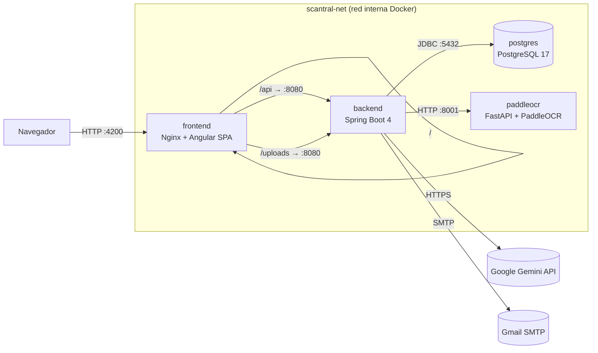

# DEPLOY — Scantral

Guía de despliegue paso a paso del stack completo (frontend + backend +
sidecar OCR + Postgres) con Docker Compose.

## Índice

- [0. Arquitectura](#0-arquitectura)
- [1. Requisitos](#1-requisitos)
- [2. Configuración (`.env`)](#2-configuración-env)
- [3. Arranque](#3-arranque)
- [4. Verificación funcional](#4-verificación-funcional)
  - [4.1 Frontend (reverse proxy)](#41-frontend-reverse-proxy)
  - [4.2 Backend — registro y login](#42-backend--registro-y-login-curl)
  - [4.3 OpenAPI / Swagger](#43-openapi--swagger)
  - [4.4 Sidecar OCR](#44-sidecar-ocr-sólo-desde-dentro-de-la-red-interna)
  - [4.5 Smoke test del rate limiter](#45-smoke-test-del-rate-limiter)
- [5. Operación](#5-operación)
- [6. Troubleshooting](#6-troubleshooting)
  - [El backend no arranca](#el-backend-no-arranca)
  - [`502 Bad Gateway`](#502-bad-gateway-al-pegar-a-api)
  - [PaddleOCR tarda muchísimo la primera vez](#paddleocr-tarda-muchísimo-la-primera-vez)
  - [Quiero conectarme a Postgres desde el host](#quiero-conectarme-a-postgres-desde-el-host)
  - [CORS al desarrollar el front fuera de Docker](#cors-al-desarrollar-el-front-fuera-de-docker)
  - [Limpiar todo y volver a empezar](#limpiar-todo-y-volver-a-empezar)
- [7. Despliegue en remoto](#7-despliegue-en-remoto)
- [8. Evidencias de CI/CD](#8-evidencias-de-cicd)

## 0. Arquitectura

El stack se compone de **4 servicios** desplegados en una red Docker
interna (`scantral-net`). Sólo el frontend publica un puerto al host;
el resto sólo es alcanzable desde dentro de la red.



| Servicio    | Imagen / build                       | Puerto host | Rol                                                                |
| ----------- | ------------------------------------ | :---------: | ------------------------------------------------------------------ |
| `frontend`  | `./frontend` (nginx:alpine)          | `4200`      | Sirve la SPA y hace **reverse proxy** del backend en `/api` y `/uploads` |
| `backend`   | `./backend` (eclipse-temurin:21-jre) | —           | API REST + lógica de negocio + auth JWT (puerto interno 8080)      |
| `paddleocr` | `./paddleocr-service`                | —           | Sidecar de OCR (FastAPI + PaddleOCR PP-OCRv4) — puerto interno 8001 |
| `postgres`  | `postgres:17`                        | —           | Persistencia (puerto interno 5432, volumen `pgdata`)               |

**Comunicaciones:**

- **Navegador → frontend (`:4200`)**: HTTP. Único punto de entrada al
  sistema. Nginx sirve los estáticos de Angular y proxy-pasa `/api/*` y
  `/uploads/*` al backend en `http://backend:8080` (resolución por DNS
  de Docker dentro de `scantral-net`). Ver
  [frontend/nginx.conf](frontend/nginx.conf).
- **backend → postgres (`:5432`)**: JDBC. URL inyectada por la variable
  `SPRING_DATASOURCE_URL` (ver
  [docker-compose.yml](docker-compose.yml)). El backend espera al
  healthcheck de Postgres (`depends_on: condition: service_healthy`).
- **backend → paddleocr (`:8001`)**: HTTP REST. Cliente Java contra
  `OCR_SERVICE_URL=http://paddleocr:8001`, con timeout configurable
  (`OCR_TIMEOUT_MS`).
- **backend → Google Gemini API**: HTTPS saliente. Extractor IA
  primario; si la `GOOGLE_API_KEY` está vacía, se usa sólo el sidecar
  OCR como fallback.
- **backend → Gmail SMTP**: envío de emails de alerta de caducidad
  (opcional; si `MAIL_*` están vacíos, no se envían).

## 1. Requisitos

- Docker Engine **≥ 24** con Docker Compose v2 (`docker compose version`).
- ~4 GB de RAM libres y ~2 GB de disco para imágenes + volúmenes.
- Salida a Internet la primera vez (descarga de imágenes base + ~16 MB
  de pesos PP-OCR; quedan cacheados en el volumen `paddleocr_models`).
- Puerto **4200** libre en el host (es el único que se publica).

## 2. Configuración (`.env`)

```bash
cp .env.example .env
```

Editar `.env`. Los valores **mínimos recomendados** para un arranque
funcional son:

```env
# Genera uno con:  openssl rand -base64 48
JWT_SECRET=<≥ 32 bytes>

# Opcional pero recomendado: si está vacía, sólo se usa el sidecar OCR
GOOGLE_API_KEY=<tu-api-key-de-gemini>

# Opcional: si están vacías, los emails de alerta no se envían
MAIL_USERNAME=tu-cuenta@gmail.com
MAIL_PASSWORD=<app-password>
```

El resto de variables (`POSTGRES_*`, `OCR_LANGUAGE`, `JWT_EXPIRATION_MS`,
`AI_MODEL`, `OCR_TIMEOUT_MS`) tienen defaults válidos en
[docker-compose.yml](docker-compose.yml) y en
[backend/src/main/resources/application.properties](backend/src/main/resources/application.properties).

## 3. Arranque

```bash
docker compose up -d --build
```

La primera vez la build tarda varios minutos (Maven dependency:go-offline,
`npm ci`, instalación de PaddlePaddle). Builds posteriores reutilizan
caché.

### Estado esperado

```bash
docker compose ps
```

```text
NAME                  IMAGE                COMMAND                  STATUS                    PORTS
scantral-db           postgres:17          "docker-entrypoint.s…"   Up (healthy)              5432/tcp
scantral-paddleocr    scantral-paddleocr   "uvicorn app:app --h…"   Up (healthy)              8001/tcp
scantral-backend      scantral-backend     "java -jar app.jar"      Up                        8080/tcp
scantral-frontend     scantral-frontend    "/docker-entrypoint.…"   Up                        0.0.0.0:4200->80/tcp
```

> Sólo `scantral-frontend` publica puertos al host. El resto sólo es
> alcanzable a través de la red interna `scantral-net`.

### Logs de arranque

```bash
docker compose logs -f backend
```

Salida sana (extracto):

```text
scantral-backend  | Started BackendDelProyectoFinalApplication in 7.842 seconds
scantral-backend  | Tomcat started on port 8080 (http) with context path '/'
scantral-backend  | HikariPool-1 - Start completed.
```

```bash
docker compose logs paddleocr | tail -n 5
```

```text
scantral-paddleocr | INFO     PaddleOCR ready: lang=latin, gpu=False
scantral-paddleocr | INFO     Uvicorn running on http://0.0.0.0:8001
```

## 4. Verificación funcional

### 4.1 Frontend (reverse proxy)

```bash
curl -I http://localhost:4200/
```

```text
HTTP/1.1 200 OK
Server: nginx/1.27.x
Content-Type: text/html
```

```bash
# El front debe proxy-pasar /api al backend y devolver 401/400 (no HTML 404)
curl -i http://localhost:4200/api/documents
```

```text
HTTP/1.1 401
Content-Type: application/json
{"error":"Token JWT ausente o inválido"}
```

### 4.2 Backend — registro y login (`curl`)

```bash
# 1) Registro
curl -s -X POST http://localhost:4200/api/auth/register \
  -H "Content-Type: application/json" \
  -d '{"name":"Demo","email":"demo@scantral.local","password":"Demo1234!"}'

# 2) Login → captura el token
TOKEN=$(curl -s -X POST http://localhost:4200/api/auth/login \
  -H "Content-Type: application/json" \
  -d '{"email":"demo@scantral.local","password":"Demo1234!"}' \
  | python -c "import sys,json;print(json.load(sys.stdin)['token'])")

echo "$TOKEN"

# 3) Endpoint autenticado
curl -s http://localhost:4200/api/documents \
  -H "Authorization: Bearer $TOKEN"
```

### 4.3 OpenAPI / Swagger

El backend no expone el puerto 8080 al host en producción (sólo internamente vía `scantral-net`), y Nginx únicamente proxea `/api/` y `/uploads/`, por lo que las rutas de Swagger **no** son accesibles en `localhost:4200`.

**Para explorar la API localmente**, añade temporalmente el mapeo de puertos en `docker-compose.yml` y reinicia el servicio:

```yaml
# docker-compose.yml — bloque backend (sólo para desarrollo)
    ports:
      - "8080:8080"
```

```bash
docker compose up -d backend
```

Luego accede en:

- Spec JSON: <http://localhost:8080/v3/api-docs>
- Swagger UI: <http://localhost:8080/swagger-ui/index.html>

> Recuerda quitar el `ports:` antes de desplegar en producción.

### 4.4 Sidecar OCR (sólo desde dentro de la red interna)

```bash
docker compose exec backend curl -s http://paddleocr:8001/health
```

```text
{"status":"ok","language":"latin","gpu":false}
```

### 4.5 Smoke test del rate limiter

`/api/auth/login` está limitado a 10 req/minuto por IP (configurable en
`scantral.security.rate-limit.*`). Para verificarlo:

```bash
for i in $(seq 1 12); do
  curl -s -o /dev/null -w "intento $i → HTTP %{http_code}\n" \
    -X POST http://localhost:4200/api/auth/login \
    -H "Content-Type: application/json" \
    -d '{"email":"x@y.z","password":"x"}';
done
```

Se debe ver un cambio de `401` (credenciales mal) a `429` (rate-limit)
a partir del intento 11. Si tienes `apache2-utils` instalado:

```bash
ab -n 50 -c 5 -p login.json -T 'application/json' \
   http://localhost:4200/api/auth/login
```

donde `login.json` contiene `{"email":"x@y.z","password":"x"}`. La
salida debe mostrar un mix de `401` y `429`, y latencias por debajo de
~100 ms en p95.

## 5. Operación

| Acción                      | Comando                                                          |
| --------------------------- | ---------------------------------------------------------------- |
| Parar todo                  | `docker compose down`                                            |
| Parar **y borrar BD**       | `docker compose down -v`  ⚠ destruye `pgdata` y `uploads`        |
| Reconstruir un servicio     | `docker compose up -d --build backend`                           |
| Logs de un servicio         | `docker compose logs -f backend`                                 |
| Shell en un contenedor      | `docker compose exec backend sh`                                 |
| Ver estado de healthchecks  | `docker inspect --format '{{.State.Health.Status}}' scantral-db` |
| Backup rápido de la BD      | `docker compose exec -T postgres pg_dump -U scantral scantral > backup.sql` |
| Restaurar BD                | `cat backup.sql \| docker compose exec -T postgres psql -U scantral -d scantral` |

## 6. Troubleshooting

### El backend no arranca

Ver logs: `docker compose logs backend`. Las causas habituales son:

- **`JWT_SECRET` ausente o < 32 bytes** → `WeakKeyException` al arrancar
  el contexto. Generar uno con `openssl rand -base64 48`.
- **Postgres aún no está listo**: el `depends_on: condition: service_healthy`
  ya lo evita, pero si pasa, mirar `docker compose logs postgres`.

Cuando ves en los logs `Tomcat started on port 8080` y `Started
BackendDelProyectoFinalApplication`, el backend está operativo aunque
`docker compose ps` no muestre `(healthy)` (no se define healthcheck a
propósito para mantener la build ligera).

### `502 Bad Gateway` al pegar a `/api/...`

El front llegó pero no encuentra al backend. Verificar:

```bash
docker compose ps backend           # debe estar (healthy)
docker compose exec frontend wget -qO- http://backend:8080/v3/api-docs | head -c 60
```

Si el `wget` falla, el backend no está respondiendo en `:8080` dentro de
`scantral-net` — revisar logs del backend.

### PaddleOCR tarda muchísimo la primera vez

Es **esperado**: en el primer arranque descarga ~16 MB de pesos desde
`paddleocr.bj.bcebos.com` (CDN lento). El healthcheck tiene
`start-period: 300s`. En arranques posteriores los pesos viven en el
volumen `paddleocr_models` y el contenedor está listo en segundos.

### Quiero conectarme a Postgres desde el host

Por seguridad, el puerto 5432 **no** se publica al host. Opciones:

```bash
# A) Cliente psql dentro del contenedor:
docker compose exec postgres psql -U scantral -d scantral

# B) Túnel temporal:
docker run --rm -it --network scantral_scantral-net -e PGPASSWORD=scantral_dev \
    postgres:17 psql -h postgres -U scantral -d scantral
```

Si necesitas exponerlo permanentemente (p. ej. para DBeaver), añade en
`docker-compose.yml`:

```yaml
  postgres:
    ports:
      - "127.0.0.1:5432:5432"   # sólo loopback, nunca 0.0.0.0
```

### CORS al desarrollar el front fuera de Docker

El backend tiene CORS configurado para `http://localhost:4200`. Si
desarrollas en otro puerto, ajustar `SecurityConfig.corsConfigurationSource()`
o usar el `proxy.conf.json` de Angular (`npm start` ya lo hace).

### Limpiar todo y volver a empezar

```bash
docker compose down -v --remove-orphans
docker image rm scantral-backend scantral-frontend scantral-paddleocr
docker compose up -d --build
```

## 7. Despliegue en remoto

Las imágenes se publican automáticamente en Docker Hub vía
[.github/workflows/docker-publish.yml](.github/workflows/docker-publish.yml)
en cada `push` a `main` y en cada tag `v*`. Repos públicos:

| Servicio  | Imagen pública                                                                |
| --------- | ----------------------------------------------------------------------------- |
| Frontend  | <https://hub.docker.com/r/nolorubio23/scantral-frontend>                      |
| Backend   | <https://hub.docker.com/r/nolorubio23/scantral-backend>                       |
| PaddleOCR | <https://hub.docker.com/r/nolorubio23/scantral-paddleocr>                     |

Tags publicados por la pipeline: `latest` (rama `main`), `sha-<corto>`,
`main` y `v*` para tags semánticos.

En un servidor con Docker:

```bash
git clone https://github.com/nolocardeno/Scantral.git
cd Scantral
cp .env.example .env && nano .env
# Sustituir `build:` por `image:` en el compose si quieres usar las
# imágenes ya publicadas en lugar de construir localmente, p. ej.:
#   image: nolorubio23/scantral-backend:latest
docker compose pull
docker compose up -d
```

Para HTTPS, lo recomendado es poner un reverse proxy externo
(Traefik, Caddy o Cloudflare Tunnel) delante del puerto 4200, en
lugar de gestionar certificados dentro del contenedor de Nginx.

## 8. Evidencias de CI/CD

[](https://github.com/nolocardeno/Scantral/actions/workflows/ci.yml)
[](https://github.com/nolocardeno/Scantral/actions/workflows/docker-publish.yml)

Ambos workflows se ejecutan en verde en `main`:

- **CI** ([ci.yml](https://github.com/nolocardeno/Scantral/actions/workflows/ci.yml)) — 3 jobs en paralelo:
  - `Backend (Spring Boot)`: levanta un Postgres 17 como service container y ejecuta `./mvnw -B verify`, que aplica el gate JaCoCo ≥ 80 %.
  - `Frontend (Angular)`: `npm ci` + `ng build --configuration production`.
  - `PaddleOCR service (Python)`: `python -m py_compile app.py`.
- **CD** ([docker-publish.yml](https://github.com/nolocardeno/Scantral/actions/workflows/docker-publish.yml)) — matriz que construye y publica las 3 imágenes (`scantral-backend`, `scantral-frontend`, `scantral-paddleocr`) en Docker Hub bajo `nolorubio23/`. Los tags se generan con [`docker/metadata-action`](https://github.com/docker/metadata-action) y la autenticación usa los secrets `DOCKERHUB_USERNAME` y `DOCKERHUB_TOKEN`.

Los badges de arriba enlazan al historial de runs y reflejan en tiempo
real el estado del último commit en `main`.
