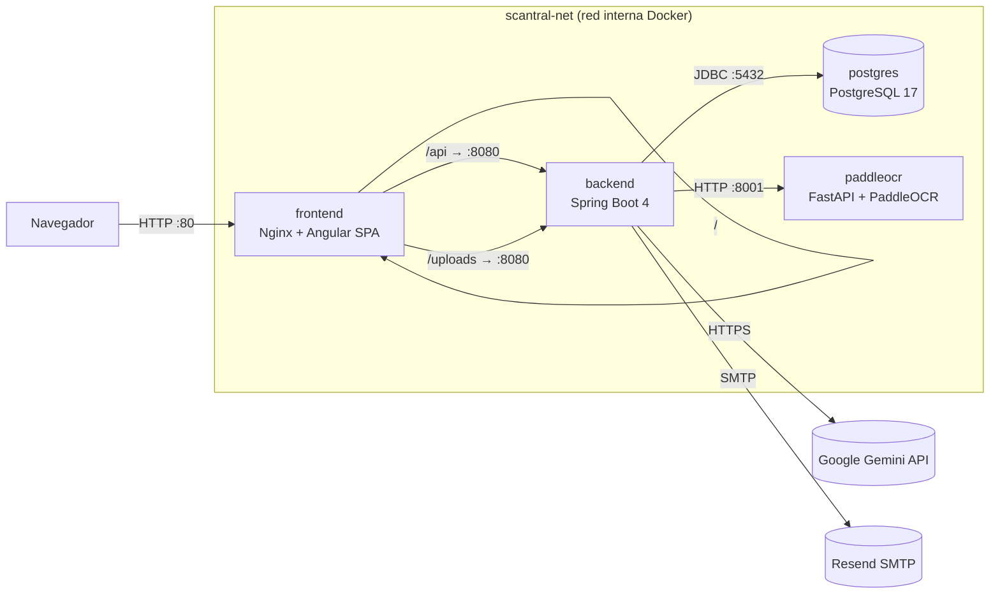

# DEPLOY — Scantral

Guía de despliegue paso a paso del stack completo (frontend + backend +
sidecar OCR + Postgres) con Docker Compose.

## Índice

- [0. Arquitectura](#0-arquitectura)
- [1. Requisitos](#1-requisitos)
- [2. Configuración (`.env`)](#2-configuración-env)
- [3. Arranque](#3-arranque)
- [4. Verificación funcional](#4-verificación-funcional)
  - [4.1 Frontend (reverse proxy)](#41-frontend-reverse-proxy)
  - [4.2 Backend — registro y login](#42-backend--registro-y-login-curl)
  - [4.3 OpenAPI / Swagger](#43-openapi--swagger)
  - [4.4 Sidecar OCR](#44-sidecar-ocr-sólo-desde-dentro-de-la-red-interna)
  - [4.5 Smoke test del rate limiter](#45-smoke-test-del-rate-limiter)
- [5. Operación](#5-operación)
- [6. Troubleshooting](#6-troubleshooting)
  - [El backend no arranca](#el-backend-no-arranca)
  - [`502 Bad Gateway`](#502-bad-gateway-al-pegar-a-api)
  - [PaddleOCR tarda muchísimo la primera vez](#paddleocr-tarda-muchísimo-la-primera-vez)
  - [Quiero conectarme a Postgres desde el host](#quiero-conectarme-a-postgres-desde-el-host)
  - [CORS al desarrollar el front fuera de Docker](#cors-al-desarrollar-el-front-fuera-de-docker)
  - [Limpiar todo y volver a empezar](#limpiar-todo-y-volver-a-empezar)
- [7. Despliegue en remoto](#7-despliegue-en-remoto)
- [8. Evidencias de CI/CD](#8-evidencias-de-cicd)
- [9. Gestión de ficheros y artefactos](#9-gestión-de-ficheros-y-artefactos)
- [10. Verificación de red del despliegue](#10-verificación-de-red-del-despliegue)

## 0. Arquitectura

El stack se compone de **4 servicios** desplegados en una red Docker
interna (`scantral-net`). Sólo el frontend publica un puerto al host;
el resto sólo es alcanzable desde dentro de la red.



| Servicio    | Imagen / build                       | Puerto host | Rol                                                                |
| ----------- | ------------------------------------ | :---------: | ------------------------------------------------------------------ |
| `frontend`  | `./frontend` (nginx:alpine)          | `80`        | Sirve la SPA y hace **reverse proxy** del backend en `/api` y `/uploads` |
| `backend`   | `./backend` (eclipse-temurin:21-jre) | —           | API REST + lógica de negocio + auth JWT (puerto interno 8080)      |
| `paddleocr` | `./paddleocr-service`                | —           | Sidecar de OCR (FastAPI + PaddleOCR PP-OCRv4) — puerto interno 8001 |
| `postgres`  | `postgres:17`                        | —           | Persistencia (puerto interno 5432, volumen `pgdata`)               |

**Comunicaciones:**

- **Navegador → frontend (`:80`)**: HTTP. Único punto de entrada al
  sistema. Nginx sirve los estáticos de Angular y proxy-pasa `/api/*` y
  `/uploads/*` al backend en `http://backend:8080` (resolución por DNS
  de Docker dentro de `scantral-net`). Ver
  [frontend/nginx.conf](frontend/nginx.conf).
- **backend → postgres (`:5432`)**: JDBC. URL inyectada por la variable
  `SPRING_DATASOURCE_URL` (ver
  [docker-compose.yml](docker-compose.yml)). El backend espera al
  healthcheck de Postgres (`depends_on: condition: service_healthy`).
- **backend → paddleocr (`:8001`)**: HTTP REST. Cliente Java contra
  `OCR_SERVICE_URL=http://paddleocr:8001`, con timeout configurable
  (`OCR_TIMEOUT_MS`).
- **backend → Google Gemini API**: HTTPS saliente. Extractor IA
  primario; si la `GOOGLE_API_KEY` está vacía, se usa sólo el sidecar
  OCR como fallback.
- **backend → Resend SMTP**: envío de emails de alerta de caducidad
  (opcional; si `MAIL_*` están vacíos, no se envían).

## 1. Requisitos

- Docker Engine **≥ 24** con Docker Compose v2 (`docker compose version`).
- ~4 GB de RAM libres y ~2 GB de disco para imágenes + volúmenes.
- Salida a Internet la primera vez (descarga de imágenes base + ~16 MB
  de pesos PP-OCR; quedan cacheados en el volumen `paddleocr_models`).
- Puerto **80** libre en el host (es el único que se publica).

## 2. Configuración (`.env`)

```bash
cp .env.example .env
```

Editar `.env`. Los valores **mínimos recomendados** para un arranque
funcional son:

```env
# Genera uno con:  openssl rand -base64 48
JWT_SECRET=<≥ 32 bytes>

# Opcional pero recomendado: si está vacía, sólo se usa el sidecar OCR
GOOGLE_API_KEY=<tu-api-key-de-gemini>

# Opcional: si están vacías, los emails de alerta no se envían.
# RESEND_API_KEY se obtiene en https://resend.com/api-keys
# MAIL_FROM debe pertenecer a un dominio verificado en Resend.
RESEND_API_KEY=<tu-api-key-de-resend>
MAIL_FROM=alertas@tudominio.com
```

El resto de variables (`POSTGRES_*`, `OCR_LANGUAGE`, `JWT_EXPIRATION_MS`,
`AI_MODEL`, `OCR_TIMEOUT_MS`) tienen defaults válidos en
[docker-compose.yml](docker-compose.yml) y en
[backend/src/main/resources/application.properties](backend/src/main/resources/application.properties).

## 3. Arranque

```bash
docker compose up -d --build
```

La primera vez la build tarda varios minutos (Maven dependency:go-offline,
`npm ci`, instalación de PaddlePaddle). Builds posteriores reutilizan
caché.

### Estado esperado

```bash
docker compose ps
```

```text
NAME                  IMAGE                COMMAND                  STATUS                    PORTS
scantral-db           postgres:17          "docker-entrypoint.s…"   Up (healthy)              5432/tcp
scantral-paddleocr    scantral-paddleocr   "uvicorn app:app --h…"   Up (healthy)              8001/tcp
scantral-backend      scantral-backend     "java -jar app.jar"      Up                        8080/tcp
scantral-frontend     scantral-frontend    "/docker-entrypoint.…"   Up                        0.0.0.0:80->80/tcp
```

Captura real del último despliegue local:


> Sólo `scantral-frontend` publica puertos al host. El resto sólo es
> alcanzable a través de la red interna `scantral-net`.

### Logs de arranque

```bash
docker compose logs -f backend
```

Salida sana (extracto):

```text
scantral-backend  | Started BackendDelProyectoFinalApplication in 7.842 seconds
scantral-backend  | Tomcat started on port 8080 (http) with context path '/'
scantral-backend  | HikariPool-1 - Start completed.
```

```bash
docker compose logs paddleocr | tail -n 5
```

```text
scantral-paddleocr | INFO     PaddleOCR ready: lang=latin, gpu=False
scantral-paddleocr | INFO     Uvicorn running on http://0.0.0.0:8001
```

## 4. Verificación funcional

### 4.1 Frontend (reverse proxy)

```bash
curl -I http://localhost/
```

```text
HTTP/1.1 200 OK
Server: nginx/1.27.x
Content-Type: text/html
```

```bash
# El front debe proxy-pasar /api al backend y devolver 401/400 (no HTML 404)
curl -i http://localhost/api/documents
```

```text
HTTP/1.1 401
Content-Type: application/json
{"error":"Token JWT ausente o inválido"}
```

### 4.2 Backend — registro y login (`curl`)

```bash
# 1) Registro
curl -s -X POST http://localhost/api/auth/register \
  -H "Content-Type: application/json" \
  -d '{"name":"Demo","email":"demo@scantral.local","password":"Demo1234!"}'

# 2) Login → captura el token
TOKEN=$(curl -s -X POST http://localhost/api/auth/login \
  -H "Content-Type: application/json" \
  -d '{"email":"demo@scantral.local","password":"Demo1234!"}' \
  | python -c "import sys,json;print(json.load(sys.stdin)['token'])")

echo "$TOKEN"

# 3) Endpoint autenticado
curl -s http://localhost/api/documents \
  -H "Authorization: Bearer $TOKEN"
```

### 4.3 OpenAPI / Swagger

El backend no expone el puerto 8080 al host (sólo internamente vía
`scantral-net`). En su lugar, Nginx proxy-pasa también `/swagger-ui/` y
`/v3/api-docs` al backend (ver [frontend/nginx.conf](frontend/nginx.conf)),
por lo que la documentación de la API es accesible directamente desde el
front sin tocar `docker-compose.yml`:

- Spec JSON: <http://localhost/v3/api-docs>
- Swagger UI: <http://localhost/swagger-ui/index.html>

```bash
curl -s http://localhost/v3/api-docs | head -c 60
```

```text
{"openapi":"3.1.0","info":{"title":"Scantral API","version":
```

### 4.4 Sidecar OCR (sólo desde dentro de la red interna)

```bash
docker compose exec backend curl -s http://paddleocr:8001/health
```

```text
{"status":"ok","language":"latin","gpu":false}
```

### 4.5 Smoke test del rate limiter

`/api/auth/login` está limitado a 10 req/minuto por IP (configurable en
`scantral.security.rate-limit.*`). Para verificarlo:

```bash
for i in $(seq 1 12); do
  curl -s -o /dev/null -w "intento $i → HTTP %{http_code}\n" \
    -X POST http://localhost/api/auth/login \
    -H "Content-Type: application/json" \
    -d '{"email":"x@y.z","password":"x"}';
done
```

Se debe ver un cambio de `401` (credenciales mal) a `429` (rate-limit)
a partir del intento 11. Si tienes `apache2-utils` instalado:

```bash
ab -n 50 -c 5 -p login.json -T 'application/json' \
   http://localhost/api/auth/login
```

donde `login.json` contiene `{"email":"x@y.z","password":"x"}`. La
salida debe mostrar un mix de `401` y `429`, y latencias por debajo de
~100 ms en p95.

## 5. Operación

| Acción                      | Comando                                                          |
| --------------------------- | ---------------------------------------------------------------- |
| Parar todo                  | `docker compose down`                                            |
| Parar **y borrar BD**       | `docker compose down -v`  ⚠ destruye `pgdata` y `uploads`        |
| Reconstruir un servicio     | `docker compose up -d --build backend`                           |
| Logs de un servicio         | `docker compose logs -f backend`                                 |
| Shell en un contenedor      | `docker compose exec backend sh`                                 |
| Ver estado de healthchecks  | `docker inspect --format '{{.State.Health.Status}}' scantral-db` |
| Backup rápido de la BD      | `docker compose exec -T postgres pg_dump -U scantral scantral > backup.sql` |
| Restaurar BD                | `cat backup.sql \| docker compose exec -T postgres psql -U scantral -d scantral` |

## 6. Troubleshooting

### El backend no arranca

Ver logs: `docker compose logs backend`. Las causas habituales son:

- **`JWT_SECRET` ausente o < 32 bytes** → `WeakKeyException` al arrancar
  el contexto. Generar uno con `openssl rand -base64 48`.
- **Postgres aún no está listo**: el `depends_on: condition: service_healthy`
  ya lo evita, pero si pasa, mirar `docker compose logs postgres`.

Cuando ves en los logs `Tomcat started on port 8080` y `Started
BackendDelProyectoFinalApplication`, el backend está operativo aunque
`docker compose ps` no muestre `(healthy)` (no se define healthcheck a
propósito para mantener la build ligera).

### `502 Bad Gateway` al pegar a `/api/...`

El front llegó pero no encuentra al backend. Verificar:

```bash
docker compose ps backend           # debe estar (healthy)
docker compose exec frontend wget -qO- http://backend:8080/v3/api-docs | head -c 60
```

Si el `wget` falla, el backend no está respondiendo en `:8080` dentro de
`scantral-net` — revisar logs del backend.

### PaddleOCR tarda muchísimo la primera vez

Es **esperado**: en el primer arranque descarga ~16 MB de pesos desde
`paddleocr.bj.bcebos.com` (CDN lento). El healthcheck tiene
`start-period: 300s`. En arranques posteriores los pesos viven en el
volumen `paddleocr_models` y el contenedor está listo en segundos.

### Quiero conectarme a Postgres desde el host

Por seguridad, el puerto 5432 **no** se publica al host. Opciones:

```bash
# A) Cliente psql dentro del contenedor:
docker compose exec postgres psql -U scantral -d scantral

# B) Túnel temporal:
docker run --rm -it --network scantral_scantral-net -e PGPASSWORD=scantral_dev \
    postgres:17 psql -h postgres -U scantral -d scantral
```

Si necesitas exponerlo permanentemente (p. ej. para DBeaver), añade en
`docker-compose.yml`:

```yaml
  postgres:
    ports:
      - "127.0.0.1:5432:5432"   # sólo loopback, nunca 0.0.0.0
```

### CORS al desarrollar el front fuera de Docker

El backend tiene CORS configurado para `http://localhost`. Si
desarrollas en otro puerto, ajustar `SecurityConfig.corsConfigurationSource()`
o usar el `proxy.conf.json` de Angular (`npm start` ya lo hace).

### Limpiar todo y volver a empezar

```bash
docker compose down -v --remove-orphans
docker image rm scantral-backend scantral-frontend scantral-paddleocr
docker compose up -d --build
```

## 7. Despliegue en remoto

Las imágenes se publican automáticamente en Docker Hub vía
[.github/workflows/docker-publish.yml](.github/workflows/docker-publish.yml)
en cada `push` a `main` y en cada tag `v*`. Repos públicos:

| Servicio  | Imagen pública                                                                |
| --------- | ----------------------------------------------------------------------------- |
| Frontend  | <https://hub.docker.com/r/nolorubio23/scantral-frontend>                      |
| Backend   | <https://hub.docker.com/r/nolorubio23/scantral-backend>                       |
| PaddleOCR | <https://hub.docker.com/r/nolorubio23/scantral-paddleocr>                     |

Tags publicados por la pipeline: `latest` (rama `main`), `sha-<corto>`,
`main` y `v*` para tags semánticos.

En un servidor con Docker:

```bash
git clone https://github.com/nolocardeno/Scantral.git
cd Scantral
cp .env.example .env && nano .env
# Sustituir `build:` por `image:` en el compose si quieres usar las
# imágenes ya publicadas en lugar de construir localmente, p. ej.:
#   image: nolorubio23/scantral-backend:latest
docker compose pull
docker compose up -d
```

Para **HTTPS en producción**, el proyecto usa **Cloudflare** como proxy
externo: el dominio `scantral.com` apunta al servidor a través de
Cloudflare, que termina TLS (certificado gestionado automáticamente) y
reenvía las peticiones por HTTP al puerto `80`. Nginx no necesita
gestionar certificados; el cifrado ocurre fuera del contenedor.

## 8. Evidencias de CI/CD

[](https://github.com/nolocardeno/Scantral/actions/workflows/ci.yml)
[](https://github.com/nolocardeno/Scantral/actions/workflows/docker-publish.yml)

Ambos workflows se ejecutan en verde en `main`:

- **CI** ([ci.yml](https://github.com/nolocardeno/Scantral/actions/workflows/ci.yml)) — 3 jobs en paralelo:
  - `Backend (Spring Boot)`: levanta un Postgres 17 como service container y ejecuta `./mvnw -B verify`, que aplica el gate JaCoCo ≥ 80 %.
  - `Frontend (Angular)`: `npm ci` + `ng test` (headless Chrome, gate cobertura ≥ 80 %) + `ng build --configuration production`.
  - `PaddleOCR service (Python)`: `python -m py_compile app.py`.
- **CD** ([docker-publish.yml](https://github.com/nolocardeno/Scantral/actions/workflows/docker-publish.yml)) — matriz que construye y publica las 3 imágenes (`scantral-backend`, `scantral-frontend`, `scantral-paddleocr`) en Docker Hub bajo `nolorubio23/`. Los tags se generan con [`docker/metadata-action`](https://github.com/docker/metadata-action) y la autenticación usa los secrets `DOCKERHUB_USERNAME` y `DOCKERHUB_TOKEN`.

Los badges de arriba enlazan al historial de runs y reflejan en tiempo
real el estado del último commit en `main`.

Capturas de los workflows en verde:


## 9. Gestión de ficheros y artefactos

Esta sección recoge **qué ficheros son necesarios** para desplegar Scantral,
**cuáles se generan**, **cuáles no deben subirse al repositorio** y **qué
datos deben persistir** entre arranques. El objetivo es que cualquiera
pueda reproducir el despliegue sólo clonando el repo y siguiendo los
pasos.

### 9.1 Inventario de artefactos del despliegue

| Artefacto | Ruta en el repo | ¿Se sube? | Rol |
| --------- | --------------- | :-------: | --- |
| Orquestación | [docker-compose.yml](docker-compose.yml) | sí | Define los 4 servicios, red interna, volúmenes y variables |
| Imagen backend | [backend/Dockerfile](backend/Dockerfile) | sí | Build multistage Maven → `eclipse-temurin:21-jre` |
| Imagen frontend | [frontend/Dockerfile](frontend/Dockerfile) | sí | Build Node 20 → `nginx:alpine` con la SPA y `nginx.conf` |
| Imagen OCR | [paddleocr-service/Dockerfile](paddleocr-service/Dockerfile) | sí | `python:3.11-slim` + FastAPI + PaddleOCR |
| Config reverse proxy | [frontend/nginx.conf](frontend/nginx.conf) | sí | Sirve la SPA y proxy-pasa `/api` y `/uploads` al backend |
| Plantilla de variables | [.env.example](.env.example) | sí | Documenta todas las variables; se copia a `.env` |
| Variables reales | `.env` | **no** | Secretos (JWT, API keys, contraseñas SMTP) |
| Workflows CI/CD | [.github/workflows/ci.yml](.github/workflows/ci.yml), [.github/workflows/docker-publish.yml](.github/workflows/docker-publish.yml) | sí | Build, tests con gate JaCoCo y publicación de imágenes |
| Config backend | [backend/src/main/resources/application.properties](backend/src/main/resources/application.properties) | sí | Datasource, JPA, JWT, mail, OCR, rate-limit |

### 9.2 Ficheros que NO se suben al repositorio

El `.gitignore` raíz garantiza que `.env` (con secretos reales) nunca llegue
al repo. La plantilla pública es `.env.example`.

```bash
$ cat .gitignore
.env
```

Verificación rápida de que no hay secretos versionados:

```bash
$ git ls-files | grep -E '^\.env$'
# (sin salida) → .env no está trackeado

$ git check-ignore -v .env
.gitignore:1:.env       .env
```

Adicionalmente, los artefactos de build de cada servicio (`backend/target/`,
`frontend/dist/`, `frontend/node_modules/`, `__pycache__/`) están ignorados
por los `.gitignore` y `.dockerignore` específicos de cada subproyecto, de
modo que **el contexto de build de Docker no envía binarios** al daemon.

### 9.3 Imágenes publicadas (tags y registry)

Las tres imágenes se publican automáticamente en Docker Hub desde
[.github/workflows/docker-publish.yml](.github/workflows/docker-publish.yml):

```yaml
# .github/workflows/docker-publish.yml — extracto
- name: Extract metadata
  uses: docker/metadata-action@v5
  with:
    images: ${{ env.REGISTRY }}/${{ env.IMAGE_OWNER }}/${{ matrix.service.name }}
    tags: |
      type=ref,event=branch
      type=ref,event=tag
      type=sha,format=short
      type=raw,value=latest,enable=${{ github.ref == format('refs/heads/{0}', 'main') }}
```

| Imagen | Registry | Tags publicados |
| ------ | -------- | --------------- |
| [`nolorubio23/scantral-frontend`](https://hub.docker.com/r/nolorubio23/scantral-frontend) | docker.io | `latest`, `main`, `sha-<corto>`, `v*` |
| [`nolorubio23/scantral-backend`](https://hub.docker.com/r/nolorubio23/scantral-backend)   | docker.io | `latest`, `main`, `sha-<corto>`, `v*` |
| [`nolorubio23/scantral-paddleocr`](https://hub.docker.com/r/nolorubio23/scantral-paddleocr) | docker.io | `latest`, `main`, `sha-<corto>`, `v*` |

Verificación local de que la imagen se ha descargado / construido:

```bash
$ docker compose images
CONTAINER             REPOSITORY           TAG       IMAGE ID       SIZE
scantral-backend      scantral-backend     latest    a1b2c3d4e5f6   312MB
scantral-frontend     scantral-frontend    latest    f6e5d4c3b2a1    52MB
scantral-paddleocr    scantral-paddleocr   latest    9f8e7d6c5b4a   1.8GB
scantral-db           postgres             17        0a1b2c3d4e5f   438MB
```

### 9.4 Datos que deben persistir (volúmenes)

La sección `volumes:` del compose declara tres volúmenes con nombre que
sobreviven a `docker compose down` (sólo se borran con `down -v`):

```yaml
# docker-compose.yml — extracto
volumes:
  pgdata:              # /var/lib/postgresql/data — base de datos
  uploads:             # /app/uploads en el backend — ficheros subidos
  paddleocr_models:    # /app/.paddleocr — pesos PP-OCR (~16 MB)
```

| Volumen | Servicio | Qué guarda | Por qué persistir |
| ------- | -------- | ---------- | ----------------- |
| `pgdata` | postgres | BD completa (usuarios, documentos, alertas) | Sin él se pierden todos los datos al recrear el contenedor |
| `uploads` | backend | Imágenes subidas por los usuarios | El backend sirve `/uploads/<id>` proxy-pasado por Nginx |
| `paddleocr_models` | paddleocr | Pesos PP-OCRv4 descargados de `paddleocr.bj.bcebos.com` | Evita re-descargar ~16 MB en cada arranque (CDN lento) |

Comprobación de que existen y son estables:

```bash
$ docker volume ls --filter name=scantral
DRIVER    VOLUME NAME
local     scantral_pgdata
local     scantral_uploads
local     scantral_paddleocr_models

$ docker volume inspect scantral_pgdata --format '{{.Mountpoint}}'
/var/lib/docker/volumes/scantral_pgdata/_data
```

Backup mínimo recomendado (ver §5):

```bash
docker compose exec -T postgres pg_dump -U scantral scantral > backup.sql
docker run --rm -v scantral_uploads:/data -v $PWD:/backup alpine \
    tar czf /backup/uploads.tgz -C /data .
```

### 9.5 Variables de entorno: dónde viven y cómo se inyectan

```bash
# 1) Plantilla pública versionada
$ head -n 12 .env.example
# ============================================================================
# Scantral — variables de entorno
# Copiar a `.env` y rellenar los valores. `.env` está en .gitignore.
# ============================================================================
POSTGRES_DB=scantral
POSTGRES_USER=scantral
POSTGRES_PASSWORD=scantral_dev
...

# 2) `.env` real (no versionado) lo lee Docker Compose automáticamente
$ cp .env.example .env && $EDITOR .env
```

Docker Compose inyecta cada variable en el contenedor con la sintaxis
`${VAR:-default}`, que define un valor por defecto razonable para arranque
local:

```yaml
# docker-compose.yml — extracto
environment:
  SPRING_DATASOURCE_URL: jdbc:postgresql://postgres:5432/${POSTGRES_DB:-scantral}
  SPRING_DATASOURCE_USERNAME: ${POSTGRES_USER:-scantral}
  SPRING_DATASOURCE_PASSWORD: ${POSTGRES_PASSWORD:-scantral_dev}
  JWT_SECRET: ${JWT_SECRET:-dev-only-change-me-please-32-bytes-minimum-secret-key-1234567890}
```

Verificación de que las variables llegan al contenedor sin exponer
secretos en logs:

```bash
$ docker compose exec backend printenv | grep -E '^(SPRING_DATASOURCE_URL|OCR_SERVICE_URL|AI_MODEL)='
SPRING_DATASOURCE_URL=jdbc:postgresql://postgres:5432/scantral
OCR_SERVICE_URL=http://paddleocr:8001
AI_MODEL=gemini-2.5-flash-lite
```

## 10. Verificación de red del despliegue

Esta sección reúne las **comprobaciones técnicas de red** que demuestran
que el despliegue funciona y que cada servicio responde por el camino
esperado: URL pública del front, puerto publicado, ruta proxy-pasada al
backend y comunicación interna entre contenedores por DNS de Docker.

### 10.1 Estado y puertos publicados

Único puerto expuesto al host: `80/tcp` del frontend. El resto vive en
la red interna `scantral-net`.

```bash
$ docker compose ps
NAME                  IMAGE                COMMAND                  STATUS                    PORTS
scantral-db           postgres:17          "docker-entrypoint.s…"   Up (healthy)              5432/tcp
scantral-paddleocr    scantral-paddleocr   "uvicorn app:app --h…"   Up (healthy)              8001/tcp
scantral-backend      scantral-backend     "java -jar app.jar"      Up                        8080/tcp
scantral-frontend     scantral-frontend    "/docker-entrypoint.…"   Up                        0.0.0.0:80->80/tcp
```

Lectura del resultado:

- `0.0.0.0:80->80/tcp` → el host alcanza al frontend en `localhost`,
  que internamente escucha en `:80`.
- Las columnas `5432/tcp`, `8001/tcp`, `8080/tcp` (sin `0.0.0.0:` delante)
  significan que esos puertos **sólo** son alcanzables desde dentro de la
  red Docker, no desde el host. Esto es intencionado.

### 10.2 URL de acceso y resolución por nombre

| Capa | Cómo se accede | Quién resuelve el nombre |
| ---- | -------------- | ------------------------ |
| Navegador → frontend | `http://localhost` | DNS del SO (loopback) |
| Navegador → API | `http://localhost/api/...` | DNS del SO + reverse proxy |
| frontend → backend | `http://backend:8080` | **DNS interno de Docker** (`scantral-net`) |
| backend → postgres | `jdbc:postgresql://postgres:5432/...` | DNS interno de Docker |
| backend → OCR | `http://paddleocr:8001` | DNS interno de Docker |

Los nombres `backend`, `postgres` y `paddleocr` se corresponden con la
clave de cada servicio en el [docker-compose.yml](docker-compose.yml).

### 10.3 Acceso al frontend desde el host (`curl -I`)

```bash
$ curl -I http://localhost/
HTTP/1.1 200 OK
Server: nginx/1.27.x
Content-Type: text/html
Content-Length: 1234
```

Quién responde: el contenedor `scantral-frontend` (Nginx), sirviendo el
`index.html` de la SPA Angular desde `/usr/share/nginx/html`.

### 10.4 Acceso al backend a través del proxy (`/api`)

```bash
$ curl -i http://localhost/api/documents
HTTP/1.1 401
Server: nginx/1.27.x
Content-Type: application/json

{"error":"Token JWT ausente o inválido"}
```

Lectura: la petición sale del host hacia `:80` (Nginx), Nginx hace
`proxy_pass http://backend:8080` (config en
[frontend/nginx.conf](frontend/nginx.conf)) y el backend responde **401
JSON** porque el endpoint requiere JWT. Una respuesta `404` HTML aquí
indicaría que el proxy no está bien montado.

### 10.5 Comunicación interna entre contenedores

Probado **desde dentro** de la red `scantral-net`, sin exponer puertos al
host:

```bash
# frontend → backend (lo que hace Nginx en cada petición /api)
$ docker compose exec frontend wget -qO- http://backend:8080/v3/api-docs | head -c 60
{"openapi":"3.1.0","info":{"title":"Scantral API","version":

# backend → paddleocr (sidecar OCR)
$ docker compose exec backend curl -s http://paddleocr:8001/health
{"status":"ok","language":"latin","gpu":false}

# backend → postgres (resolución DNS + conectividad TCP)
$ docker compose exec backend sh -c 'getent hosts postgres'
172.20.0.2      postgres
```

### 10.6 Inspección de la red Docker

```bash
$ docker network ls --filter name=scantral
NETWORK ID     NAME                DRIVER    SCOPE
1a2b3c4d5e6f   scantral_scantral-net  bridge    local

$ docker network inspect scantral_scantral-net --format '{{range .Containers}}{{.Name}} {{.IPv4Address}}{{"\n"}}{{end}}'
scantral-frontend   172.20.0.5/16
scantral-backend    172.20.0.4/16
scantral-paddleocr  172.20.0.3/16
scantral-db         172.20.0.2/16
```

Los cuatro contenedores comparten la misma red bridge, por eso pueden
llamarse por nombre de servicio.

### 10.7 Comprobación de aislamiento (lo que NO debe responder)

Desde el host, los puertos internos **no** deben estar accesibles:

```bash
$ curl -s -o /dev/null -w "%{http_code}\n" --max-time 2 http://localhost:8080/v3/api-docs
000   # connection refused / timeout — esperado: backend NO publicado

$ curl -s -o /dev/null -w "%{http_code}\n" --max-time 2 http://localhost:5432/
000   # esperado: Postgres NO publicado al host
```

Este resultado confirma el **principio de mínima exposición**: el único
punto de entrada es `:80`.

### 10.8 Resolución de nombre en local (opcional)

Para acceder con un nombre amigable (`scantral.local`) en lugar de
`localhost`, basta con añadirlo al `hosts` del sistema:

```text
# /etc/hosts  (Linux/macOS)  o  C:\Windows\System32\drivers\etc\hosts
127.0.0.1   scantral.local
```

Verificación:

```bash
$ curl -I http://scantral.local/
HTTP/1.1 200 OK
Server: nginx/1.27.x
```

El frontend responde igual que con `localhost` porque Nginx no filtra por
`server_name` (escucha cualquier Host en `:80`).
