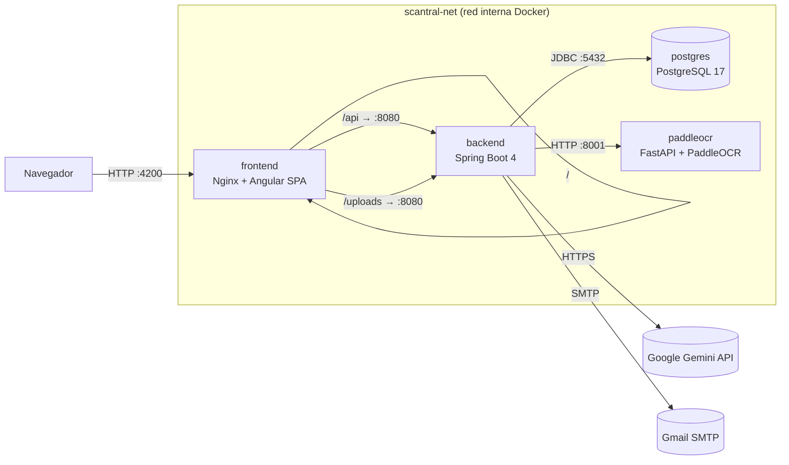

<div align="center">
  

  # Tus documentos y tickets, organizados y siempre a mano.

  > **Aplicación en producción:** [https://scantral.com](https://scantral.com)
</div>

Scantral es una aplicación web full-stack para la gestión inteligente de documentos personales. Combina un backend en **Spring Boot 4** con un frontend **Angular 20**, un sidecar de OCR en Python y una integración opcional con IA generativa, todo contenerizado con **Docker Compose** y desplegado en producción en [scantral.com](https://scantral.com).

El proyecto nació con el objetivo de resolver un problema cotidiano: la dispersión y el olvido de documentos importantes. Scantral propone un único lugar donde almacenarlos, mantenerlos actualizados y recibir avisos automáticos antes de que expiren, con la mínima fricción posible para el usuario.

Técnicamente, el sistema está diseñado siguiendo principios de arquitectura limpia, seguridad por defecto y calidad de código verificable: cobertura de tests ≥ 80 % en backend y frontend, pipeline CI/CD con **GitHub Actions** y HTTPS gestionado por **Cloudflare**.

## Índice

- [Características principales](#características-principales)
- [Stack](#stack)
- [Arquitectura](#arquitectura)
- [Estructura del repositorio](#estructura-del-repositorio)
- [Instalación](#instalación)
- [Tests](#tests)
- [CI/CD](#cicd)
- [HTTPS](#https)
- [Documentación](#documentación)
- [Autor](#autor)
- [Licencia](#licencia)

## Características principales

### Gestión de documentos

- **Almacenamiento centralizado** — todos los documentos en un único lugar seguro, accesible desde cualquier dispositivo con navegador.
- **Subida por foto** — el usuario fotografía o escanea el documento; la app procesa la imagen y la asocia al registro.
- **Tipos y categorías** — los documentos se clasifican por tipo (identidad, vehículo, médico, financiero…) y pueden filtrarse y buscarse por nombre, tipo, fecha y otros campos.

### Grupos compartidos

- **Creación de grupos** — cualquier usuario puede crear un grupo de documentos con nombre y descripción propios.
- **Código de acceso** — cada grupo genera automáticamente un código único de 10 caracteres que el creador puede compartir para invitar a otros usuarios.
- **Unirse y abandonar grupos** — los usuarios se unen a un grupo introduciendo su código y pueden abandonarlo en cualquier momento.
- **Documentos compartidos** — los miembros de un grupo pueden añadir documentos al grupo y consultarlos, facilitando el acceso compartido dentro de una familia o equipo.

### Extracción automática de datos (OCR + IA opcional)

- **OCR integrado siempre activo** — un sidecar **PaddleOCR PP-OCRv4** (Python/FastAPI) realiza el reconocimiento óptico de texto de forma completamente offline; funciona sin ninguna configuración adicional.
- **IA como capa opcional** — si se configura una API key de **Google Gemini 2.5 Flash Lite**, la IA enriquece el resultado identificando el tipo de documento y estructurando los campos extraídos con mayor precisión semántica.
- **Revisión antes de guardar** — los datos extraídos se presentan al usuario en un formulario editable para que pueda corregirlos antes de confirmar, evitando errores silenciosos.
- **Soporte multiidioma OCR** — el idioma del motor OCR es configurable mediante variable de entorno.

### Alertas y notificaciones

- **Alertas de caducidad** — el sistema comprueba periódicamente las fechas de expiración y envía un email de aviso cuando un documento está próximo a caducar.
- **Antelación configurable** — cada usuario puede definir con cuántos días de anticipación quiere recibir la notificación.
- **Envío por Gmail SMTP** — las alertas se envían a través de una cuenta de Gmail con App Password, sin necesidad de infraestructura de email propia.

### Seguridad y autenticación

- **Registro y login seguros** — autenticación basada en **JWT firmado con HMAC-SHA**, con tokens de corta duración y renovación controlada.
- **Lista negra de tokens** — los tokens invalidados (logout) se añaden a una blacklist en memoria para impedir su reutilización hasta que expiren.
- **Rate limiting por IP** — filtro de límite de peticiones por dirección IP para mitigar ataques de fuerza bruta y abuso de la API.
- **Protección CORS** — política de orígenes configurada para restringir el acceso a la API desde dominios no autorizados.
- **Contraseñas con BCrypt** — nunca se almacena la contraseña en texto plano; se usa hashing con BCrypt y factor de coste configurable.

### Interfaz y experiencia de usuario

- **SPA Angular 20** — interfaz de usuario reactiva construida como Single Page Application, con navegación fluida sin recargas.
- **Modo claro / oscuro** — tema seleccionable por el usuario, persistido en sus preferencias.
- **Diseño responsive** — la interfaz se adapta a escritorio, tablet y móvil mediante SCSS con variables de diseño centralizado.
- **Swagger UI integrado** — documentación interactiva de la API REST disponible en `/swagger-ui/index.html` para facilitar la integración y el testing.

## Stack

| Capa     | Tecnología                                                         |
| -------- | ------------------------------------------------------------------ |
| Frontend | Angular 20 + SCSS, servido por Nginx (también hace de reverse proxy) |
| Backend  | Spring Boot 4 / Java 21, Spring Security 6 + JWT, JPA, JaCoCo ≥ 80 % |
| OCR      | Sidecar Python (FastAPI + PaddleOCR PP-OCRv4) en `paddleocr-service` |
| IA       | Google Gemini 2.5 Flash Lite como capa opcional de extracción      |
| BD       | PostgreSQL 17                                                      |
| Empaquetado | Docker + Docker Compose (3 imágenes publicadas en Docker Hub)   |
| CI/CD    | GitHub Actions: build + tests + JaCoCo gate, push a Docker Hub     |

## Arquitectura



| Servicio    | Imagen / build              | Puerto host | Rol                                             |
| ----------- | --------------------------- | :---------: | ----------------------------------------------- |
| `frontend`  | `./frontend` (nginx:alpine) | `4200`      | Sirve la SPA y hace **reverse proxy** del back  |
| `backend`   | `./backend` (eclipse-temurin:21-jre) | —  | API REST + lógica de negocio + auth JWT         |
| `paddleocr` | `./paddleocr-service`       | —           | Sidecar de OCR (fallback cuando no hay IA)      |
| `postgres`  | `postgres:17`               | —           | Persistencia                                    |

Sólo el `frontend` publica un puerto al host. Backend, BD y sidecar OCR
viven en la red Docker interna `scantral-net` y se comunican por nombre
de servicio. El front proxy-pasa `/api/*` y `/uploads/*` al backend (ver
[frontend/nginx.conf](frontend/nginx.conf)).

## Estructura del repositorio

```
.
├── backend/             Spring Boot 4 (API + dominio)
├── frontend/            Angular 20 (SPA) + Nginx (reverse proxy)
├── paddleocr-service/   Sidecar Python (FastAPI + PaddleOCR)
├── docs/                Memoria del TFG
├── .github/workflows/   CI (build + tests) y CD (Docker Hub)
├── docker-compose.yml   Orquestación de los 4 servicios
├── .env.example         Plantilla de variables de entorno
├── DEPLOY.md            Guía de despliegue paso a paso
└── README.md            (este fichero)
```

Cada servicio tiene su propio README con detalles internos:

- [backend/README.md](backend/README.md) — capas, modelo de datos, seguridad y endpoints
- [frontend/README.md](frontend/README.md) — estructura Angular, sistema de temas, build
- [paddleocr-service/README.md](paddleocr-service/README.md) — API del sidecar OCR

## Instalación

### Requisitos previos

- **Docker Engine ≥ 24** con **Docker Compose v2** — única dependencia real.
- 4 GB de RAM libres (la primera vez PaddleOCR descarga ~16 MB de modelos; la imagen pesa ~1 GB).
- (Opcional) API key de [Google AI Studio](https://aistudio.google.com/apikey) para la extracción IA con Gemini.
- (Opcional) Cuenta de Gmail con [App Password](https://myaccount.google.com/apppasswords) para las alertas por email.

### Pasos

```bash
# 1. Clonar el repositorio
git clone https://github.com/nolocardeno/Scantral.git
cd Scantral

# 2. Crear el fichero de variables de entorno
cp .env.example .env

# 3. Editar .env con tus valores (ver tabla más abajo)
#    Como mínimo, en producción debes establecer JWT_SECRET

# 4. Levantar todos los servicios
docker compose up -d --build

# 5. Comprobar que los contenedores están sanos
docker compose ps
```

Cuando los healthchecks pasen a `healthy`:

| URL                                           | Descripción                         |
| --------------------------------------------- | ----------------------------------- |
| <http://localhost:4200>                       | Aplicación (SPA)                    |
| <http://localhost:4200/api/auth/register>     | API (vía reverse proxy)             |
| <http://localhost:4200/swagger-ui/index.html> | Documentación OpenAPI / Swagger UI  |

> Para la guía de despliegue paso a paso, comandos de verificación, ejemplos `curl`
> y troubleshooting, ver [DEPLOY.md](DEPLOY.md).

### Variables de entorno

Todas las variables están documentadas en [.env.example](.env.example).
Resumen:

| Variable             | Obligatoria | Descripción                                            |
| -------------------- | :---------: | ------------------------------------------------------ |
| `POSTGRES_DB/USER/PASSWORD` | no   | Credenciales BD (default: `scantral` / `scantral_dev`) |
| `JWT_SECRET`         | **sí** (prod) | Secreto HMAC ≥ 32 bytes para firmar los JWT          |
| `JWT_EXPIRATION_MS`  | no          | TTL del token (default 24 h)                           |
| `MAIL_USERNAME`      | no          | Cuenta Gmail para enviar alertas                       |
| `MAIL_PASSWORD`      | no          | App password de Gmail                                  |
| `GOOGLE_API_KEY`     | no          | Key de Google AI Studio (Gemini). Si vacía → solo OCR  |
| `AI_MODEL`           | no          | Modelo de Gemini (default `gemini-2.5-flash-lite`)     |
| `OCR_LANGUAGE`       | no          | Idioma PaddleOCR (default `latin`)                     |
| `OCR_TIMEOUT_MS`     | no          | Timeout HTTP backend → sidecar OCR                     |

## Tests

### Backend

Requiere Java 21 y Maven (o usar el wrapper incluido). Los tests de integración levantan PostgreSQL automáticamente vía Testcontainers.

```bash
cd backend
./mvnw -B verify          # unit + integración + gate JaCoCo ≥ 80 %
```

El informe de cobertura se genera en `backend/target/site/jacoco/index.html`.

### Frontend

```bash
cd frontend
npm ci
npx ng test --watch=false --browsers=ChromeHeadless --code-coverage
```

El informe de cobertura se genera en `frontend/coverage/frontend/index.html`.

## CI/CD

- **CI** ([.github/workflows/ci.yml](.github/workflows/ci.yml)): se dispara en cada `push`/`pull_request` a `main`.
  - Backend: `./mvnw -B verify` con Postgres 17 como service container y gate JaCoCo ≥ 80 %.
  - Frontend: `npm ci` + `ng test` (headless Chrome, gate cobertura ≥ 80 %) + `ng build --configuration production`.
  - OCR: `python -m py_compile app.py`.
- **CD** ([.github/workflows/docker-publish.yml](.github/workflows/docker-publish.yml)): build & push de las 3 imágenes a Docker Hub en cada `push` a `main` y en cada tag `v*`. Usa `secrets.DOCKERHUB_USERNAME` y `DOCKERHUB_TOKEN`.

## HTTPS

El despliegue local sirve **HTTP** sobre `localhost:4200` porque está
pensado para entorno de desarrollo / aula.

En **producción**, el HTTPS se gestiona externamente mediante
**Cloudflare**: el dominio `scantral.com` apunta al servidor a través de
Cloudflare, que termina TLS (certificado gestionado automáticamente) y
reenvía las peticiones por HTTP al puerto `4200` del host. Nginx no
necesita gestionar certificados ni escuchar en `:443`; el cifrado se
delegó completamente al proxy externo.

Esta arquitectura es preferible a hornear `certbot` dentro del contenedor
de Nginx porque simplifica la renovación automática de certificados, añade
una capa de CDN y protección DDoS sin coste adicional, y mantiene los
contenedores stateless.

## Documentación

### Memoria del proyecto (`docs/`)

| Documento | Descripción |
| --------- | ----------- |
| [01 — Introducción](docs/01-introduccion.md) | Origen de la idea, motivación y objetivos del proyecto |
| [02 — Descripción](docs/02-descripcion.md) | Descripción funcional detallada de cada funcionalidad |
| [03 — Instalación](docs/03-instalacion.md) | Manual de instalación y puesta en marcha paso a paso |
| [04 — Guía de estilos](docs/04-guia-estilos.md) | Prototipo Figma, paleta de colores y sistema de diseño |
| [05 — Diseño](docs/05-diseno.md) | Modelo de datos (E-R), arquitectura técnica y decisiones de diseño |
| [06 — Desarrollo](docs/06-desarrollo.md) | Secuencia de desarrollo, patrones usados y decisiones técnicas |
| [07 — Pruebas](docs/07-pruebas.md) | Metodología, tipos de prueba y resultados de cobertura |
| [08 — Despliegue](docs/08-despliegue.md) | Despliegue en producción (resumen de memoria) |
| [09 — Manual de usuario](docs/09-manual-usuario.md) | Guía de uso de la aplicación para el usuario final |
| [10 — Conclusiones](docs/10-conclusiones.md) | Evaluación crítica, lecciones aprendidas y trabajo futuro |

### Guías técnicas y READMEs de servicio

| Documento | Servicio | Descripción |
| --------- | -------- | ----------- |
| [DEPLOY.md](DEPLOY.md) | — | Guía de despliegue paso a paso: comandos, variables, verificación y troubleshooting |
| [backend/README.md](backend/README.md) | Backend (Spring Boot) | Capas de la aplicación, modelo de datos, seguridad, endpoints y ejecución local |
| [frontend/README.md](frontend/README.md) | Frontend (Angular) | Estructura del proyecto Angular, sistema de temas, comandos de build y desarrollo |
| [paddleocr-service/README.md](paddleocr-service/README.md) | Sidecar OCR (Python) | API del sidecar OCR, endpoints disponibles, modelos y configuración de idioma |

### Diseño UI/UX (Figma)

| Recurso | Enlace |
| ------- | ------ |
| Proyecto completo | [Ver en Figma](https://www.figma.com/files/team/1552254663656061275/project/558404348?fuid=1552254659656102579) |
| Fichero principal (wireframes + mockups) | [Ver en Figma](https://www.figma.com/design/XS6oqxCcUzYrxzmrNU0OSP/Proyecto-principal?t=PUxqNLIMogn2N5bH-1) |

## Autor

<table>
  <tr>
    <td></td>
    <td valign="middle"><strong>Manolo Cárdeno Sánchez</strong><br/>Técnico Superior en DAW</td>
    <td valign="middle"><a href="https://github.com/nolocardeno">GitHub · nolocardeno</a></td>
    <td valign="middle"><a href="https://www.linkedin.com/in/manolo-cardeno-sanchez">LinkedIn</a></td>
  </tr>
</table>

## Licencia

© 2026 Manolo Cárdeno Sánchez. Todos los derechos reservados.

Este repositorio contiene el Trabajo Fin de Ciclo del CFGS de Desarrollo de Aplicaciones Web. Se permite la consulta y uso del código con fines educativos, citando al autor. Queda prohibida su reproducción total o parcial, distribución o uso comercial sin autorización expresa del autor.
