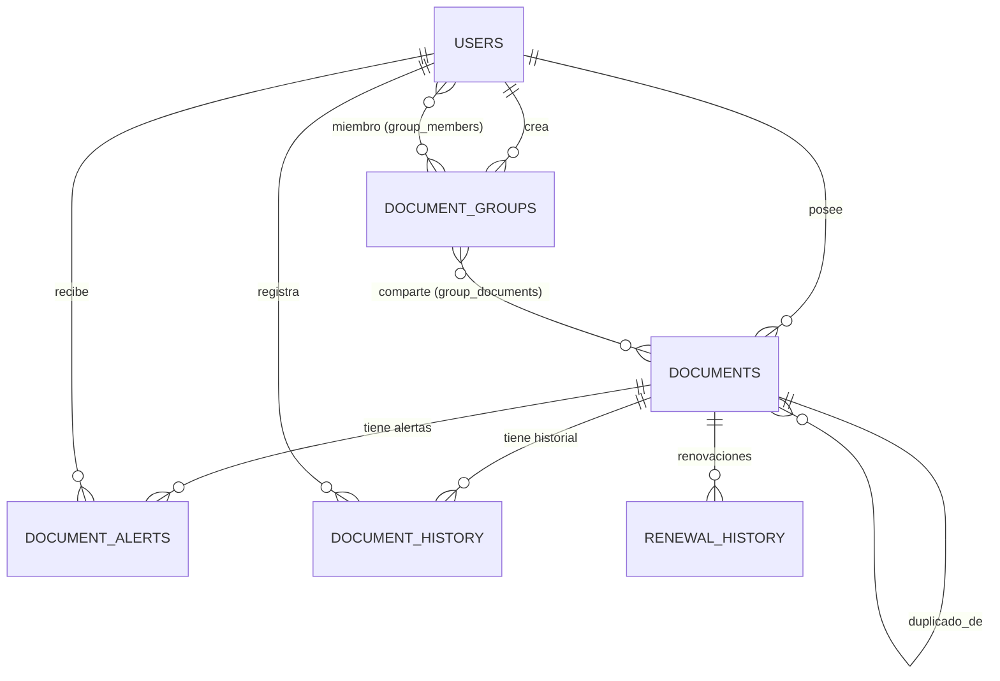

# Scantral - Backend

API REST en Spring Boot 4 / Java 21. Implementa todo el dominio de la
aplicación: usuarios, documentos personales y compartidos, alertas de
caducidad, extracción de datos por OCR + IA, grupos con código de acceso,
dashboard y panel de administración.

## Índice

- [Stack](#stack)
- [Arquitectura](#arquitectura)
  - [Estructura de paquetes](#estructura-de-paquetes)
- [Modelo de datos](#modelo-de-datos)
  - [Diagrama entidad-relación](#diagrama-entidad-relación)
  - [Diccionario de datos](#diccionario-de-datos)
  - [Enumeraciones](#enumeraciones)
  - [Esquema](#esquema)
- [Seguridad](#seguridad)
  - [Autenticación](#autenticación)
  - [Autorización con roles](#autorización-con-roles)
  - [Endpoints públicos](#endpoints-públicos)
  - [Logout y revocación de tokens](#logout-y-revocación-de-tokens)
  - [Rate limiting](#rate-limiting)
  - [Otros detalles](#otros-detalles)
- [API REST](#api-rest)
  - [Filtrado y paginación](#filtrado-y-paginación)
  - [Endpoints](#endpoints)
  - [Códigos de respuesta](#códigos-de-respuesta)
  - [Documentación interactiva](#documentación-interactiva)
- [Tests y cobertura](#tests-y-cobertura)
- [Configuración y ejecución](#configuración-y-ejecución)

## Stack

| Capa          | Tecnología                                                       |
| ------------- | ---------------------------------------------------------------- |
| Framework     | Spring Boot 4.0.3, Spring Web MVC, Spring Data JPA, Spring Security 6 |
| Lenguaje      | Java 21                                                          |
| Persistencia  | PostgreSQL 16 (esquema generado por Hibernate `ddl-auto=update`) |
| Auth          | JWT HS256 (jjwt 0.12.6), roles `USER` y `ADMIN`                  |
| Documentación | springdoc-openapi 3.0, Swagger UI en `/swagger-ui.html`          |
| Tests         | JUnit 5, Mockito, AssertJ, Spring Security Test, H2 in-memory    |
| Cobertura     | JaCoCo 0.8.12 con gate ≥ 80 % en `verify`                        |
| OCR / IA      | Sidecar FastAPI con PaddleOCR, Google Gemini 2.5 Flash Lite      |

## Arquitectura

Cada petición pasa por dos filtros antes de llegar al controller:

1. `RateLimitFilter`: limita peticiones por IP en `/api/auth/**` (responde 429).
2. `JwtAuthFilter`: valida el token, comprueba la blacklist y carga el usuario en el `SecurityContext` (responde 401 si falla).

A partir de ahí se aplica la separación clásica en capas:

- `controller/`: solo orquesta HTTP. Valida con `@Valid` y maneja DTOs.
- `service/`: lógica de negocio, transacciones (`@Transactional`) y autorización a nivel de recurso.
- `repository/`: Spring Data JPA + `JpaSpecificationExecutor` para consultas dinámicas.
- `model/`: entidades JPA. No salen de la capa de servicio.

`GlobalExceptionHandler` (`@RestControllerAdvice`) traduce todas las
excepciones a un JSON homogéneo, y `JsonAuthErrorHandler` hace lo mismo
para los 401/403 que dispara Spring Security (que por defecto devolvería
HTML). `spring.jpa.open-in-view=false` para que las consultas se cierren
dentro del servicio.

### Estructura de paquetes

```
com.nolocardeno.backend
├── BackendDelProyectoFinalApplication.java
├── config/        SecurityConfig, OpenApiConfig, WebConfig, DataLoader
├── controller/    REST controllers
├── dto/           DTOs request/response
├── exception/     GlobalExceptionHandler, ResourceNotFoundException
├── model/         Entidades JPA y enums
├── repository/    JpaRepository + spec/ con Specifications
├── security/      JwtService, JwtAuthFilter, RateLimitFilter,
│                  TokenBlacklistService, CustomUserDetails*, AuthUtils
└── service/       Lógica de negocio
    └── processing/   Pipeline OCR + IA
```

## Modelo de datos

### Diagrama entidad-relación



8 tablas: `users`, `documents`, `document_groups`, `document_alerts`,
`document_history`, `renewal_history`, `group_members` (puente N-M) y
`group_documents` (puente N-M).

### Diccionario de datos

#### `users`

| Columna              | Tipo            | Restricciones       | Descripción                   |
| -------------------- | --------------- | ------------------- | ----------------------------- |
| `id`                 | `BIGINT`        | PK, autoincrement   | Identificador del usuario     |
| `email`              | `VARCHAR(255)`  | UNIQUE, NOT NULL    | Correo de login               |
| `password_hash`      | `VARCHAR(255)`  | NOT NULL            | Hash BCrypt de la contraseña  |
| `name`               | `VARCHAR(255)`  | NOT NULL            | Nombre visible                |
| `profile_image_path` | `VARCHAR(255)`  | NULL                | Ruta del avatar               |
| `role`               | `VARCHAR(16)`   | NOT NULL            | Enum `Role` (`USER`, `ADMIN`) |
| `created_at`         | `TIMESTAMP`     | NOT NULL, immutable | Fecha de alta                 |

#### `documents`

| Columna           | Tipo            | Restricciones              | Descripción                                      |
| ----------------- | --------------- | -------------------------- | ------------------------------------------------ |
| `id`              | `BIGINT`        | PK                         | Identificador                                    |
| `user_id`         | `BIGINT`        | FK → `users(id)`, NOT NULL | Propietario                                      |
| `type`            | `VARCHAR`       | NOT NULL, enum             | `DocumentType` (DNI, PASSPORT, ITV, …)           |
| `kind`            | `VARCHAR`       |                            | Subtipo libre                                    |
| `title`           | `VARCHAR`       | NOT NULL                   | Título legible                                   |
| `category`        | `VARCHAR`       |                            | Categoría opcional                               |
| `store_name`      | `VARCHAR`       |                            | Comercio (recibos)                               |
| `amount`          | `DECIMAL(10,2)` |                            | Importe (recibos / facturas)                     |
| `issue_date`      | `DATE`          |                            | Fecha de emisión                                 |
| `expiry_date`     | `DATE`          |                            | Fecha de caducidad                               |
| `image_path`      | `VARCHAR`       |                            | Imagen escaneada                                 |
| `extracted_data`  | `TEXT`          |                            | JSON con datos extraídos                         |
| `ai_processed`    | `BOOLEAN`       | default `false`            | Marca si pasó por el pipeline de IA              |
| `notes`           | `TEXT`          |                            | Notas del usuario                                |
| `status`          | `VARCHAR`       | NOT NULL, enum             | `ACTIVE`, `EXPIRING_SOON`, `EXPIRED`, `RENEWED`  |
| `is_duplicate_of` | `BIGINT`        | FK → `documents(id)`       | Auto-referencia: documento del que es duplicado  |
| `created_at`      | `TIMESTAMP`     | NOT NULL                   |                                                  |
| `updated_at`      | `TIMESTAMP`     |                            |                                                  |

#### `document_groups`

| Columna                 | Tipo          | Restricciones    | Descripción                        |
| ----------------------- | ------------- | ---------------- | ---------------------------------- |
| `id`                    | `BIGINT`      | PK               |                                    |
| `name`                  | `VARCHAR`     | NOT NULL         | Nombre del grupo                   |
| `description`           | `VARCHAR`     |                  |                                    |
| `access_code`           | `VARCHAR(10)` | UNIQUE           | Código alfanumérico de invitación  |
| `creator_id`            | `BIGINT`      | FK `users(id)`   | Creador                            |
| `all_can_add_documents` | `BOOLEAN`     | NOT NULL         | Si los miembros pueden añadir docs |
| `created_at`            | `TIMESTAMP`   | NOT NULL         |                                    |
| `updated_at`            | `TIMESTAMP`   |                  |                                    |

`access_code` se genera en `@PrePersist` con un UUID truncado.

#### `group_members` (puente N-M `users` ↔ `document_groups`)

| Columna    | Tipo     | Restricciones                        |
| ---------- | -------- | ------------------------------------ |
| `group_id` | `BIGINT` | FK → `document_groups(id)`, parte PK |
| `user_id`  | `BIGINT` | FK → `users(id)`, parte PK           |

#### `group_documents` (puente N-M `documents` ↔ `document_groups`)

| Columna       | Tipo     | Restricciones                        |
| ------------- | -------- | ------------------------------------ |
| `group_id`    | `BIGINT` | FK → `document_groups(id)`, parte PK |
| `document_id` | `BIGINT` | FK → `documents(id)`, parte PK       |

#### `document_alerts`

| Columna              | Tipo        | Restricciones                  | Descripción                      |
| -------------------- | ----------- | ------------------------------ | -------------------------------- |
| `id`                 | `BIGINT`    | PK                             |                                  |
| `document_id`        | `BIGINT`    | FK → `documents(id)`, NOT NULL |                                  |
| `user_id`            | `BIGINT`    | FK → `users(id)`, NOT NULL     | Destinatario de la notificación  |
| `days_before_expiry` | `INT`       | NOT NULL                       | Días antes de caducar            |
| `notified_at`        | `TIMESTAMP` |                                | Última vez que se envió el email |
| `created_at`         | `TIMESTAMP` | NOT NULL                       |                                  |

Restricción de unicidad `uq_alert_document_user_days`
sobre (`document_id`, `user_id`, `days_before_expiry`).

#### `document_history`

| Columna       | Tipo        | Restricciones                  | Descripción                                                             |
| ------------- | ----------- | ------------------------------ | ----------------------------------------------------------------------- |
| `id`          | `BIGINT`    | PK                             |                                                                         |
| `document_id` | `BIGINT`    | FK → `documents(id)`, NOT NULL |                                                                         |
| `user_id`     | `BIGINT`    | FK → `users(id)`, NOT NULL     | Autor del cambio                                                        |
| `change_type` | `VARCHAR`   | NOT NULL                       | Enum: `CREATED`, `UPDATED`, `IMAGE_UPLOADED`, `RENEWED`, `DATES_UPDATED` |
| `description` | `TEXT`      |                                |                                                                         |
| `changed_at`  | `TIMESTAMP` | NOT NULL                       |                                                                         |

#### `renewal_history`

| Columna                | Tipo        | Restricciones                  |
| ---------------------- | ----------- | ------------------------------ |
| `id`                   | `BIGINT`    | PK                             |
| `document_id`          | `BIGINT`    | FK → `documents(id)`, NOT NULL |
| `previous_expiry_date` | `DATE`      | NOT NULL                       |
| `new_expiry_date`      | `DATE`      | NOT NULL                       |
| `renewed_at`           | `TIMESTAMP` | NOT NULL                       |
| `notes`                | `TEXT`      |                                |

### Enumeraciones

| Enum                  | Valores                                                                            |
| --------------------- | ---------------------------------------------------------------------------------- |
| `Role`                | `USER`, `ADMIN`                                                                    |
| `DocumentType`        | `DNI`, `PASSPORT`, `DRIVING_LICENSE`, `INSURANCE`, `ITV`, `RECEIPT`, `WARRANTY`, … |
| `DocumentStatus`      | `ACTIVE`, `EXPIRING_SOON`, `EXPIRED`, `RENEWED`                                    |
| `DocumentHistoryType` | `CREATED`, `UPDATED`, `IMAGE_UPLOADED`, `RENEWED`, `DATES_UPDATED`                 |

### Esquema

El esquema lo genera Hibernate al arrancar mediante
`spring.jpa.hibernate.ddl-auto=update`, leyendo las anotaciones JPA de las
entidades del paquete `model/`.

## Seguridad

### Autenticación

JWT stateless firmado con HS256 y la clave de `scantral.security.jwt.secret`.
`JwtService` se encarga de emitir y validar los tokens (jjwt 0.12.6).
`JwtAuthFilter` lee la cabecera `Authorization: Bearer <token>` en cada
petición, comprueba firma, expiración y blacklist, y carga el usuario en
el `SecurityContext`. Los controladores acceden al usuario autenticado
con `@AuthenticationPrincipal CustomUserDetails`.

### Autorización con roles

Hay dos roles, `USER` y `ADMIN`, y la autorización se aplica en tres
niveles:

- A nivel de URL en `SecurityConfig` (`/api/admin/**` requiere `hasRole(ADMIN)`).
- A nivel de método con `@PreAuthorize("hasRole('ADMIN')")` en `AdminController`.
- A nivel de recurso con `AuthUtils.ensureSelfOrAdmin(...)` en los servicios, para que un `USER` solo opere sobre sus propios datos.

### Endpoints públicos

- `POST /api/auth/login`
- `POST /api/auth/register`
- `GET /api/users/{id}/profile-image` (para que el `` funcione sin cabeceras)
- `GET /v3/api-docs`, `/swagger-ui.html`, `/swagger-ui/**`

Todo lo demás requiere JWT válido.

### Logout y revocación de tokens

`POST /api/auth/logout` (autenticado) responde 204. `AuthService.logout()`
extrae la expiración del token y lo guarda en `TokenBlacklistService`,
que es un `ConcurrentHashMap<token, expirationEpochMs>` que se purga
solo cuando los tokens caducan. `JwtAuthFilter` rechaza con 401 cualquier
token que esté en la blacklist.

La blacklist es in-memory: vale para una sola instancia (que es el caso
de este proyecto). Si se quisiera escalar a varias réplicas habría que
moverla a Redis.

### Rate limiting

`RateLimitFilter` se ejecuta antes que `JwtAuthFilter` y limita las
peticiones por IP a `/api/auth/login` y `/api/auth/register`. La
implementación es una ventana fija con `ConcurrentHashMap<ip, Window>` y
un `AtomicInteger` como contador. Respeta `X-Forwarded-For` cuando llega
detrás de Nginx, si no usa `request.getRemoteAddr()`. Cuando se supera
el límite responde 429 con
`{"error":"Demasiadas peticiones, inténtalo en unos segundos"}`.

Es configurable en `application.properties`:

```properties
scantral.security.rate-limit.window-ms=60000
scantral.security.rate-limit.max-requests=10
```

### Otros detalles

- Mismo mensaje en login fallido tanto si el email no existe como si la contraseña es incorrecta (para no revelar qué emails están registrados).
- 401, 403 y 429 se devuelven siempre como JSON, no como HTML.
- CORS configurado en `SecurityConfig` para el frontend Angular.
- `spring.servlet.multipart.max-file-size=10MB` para limitar uploads.
- Contraseñas hasheadas con BCrypt.

## API REST

### Filtrado y paginación

Los listados siguen las convenciones de Spring Data Web:

- `?page=0&size=20&sort=campo,asc|desc`
- Tamaño por defecto 20 (`@PageableDefault(size = 20)`).
- La respuesta es un `Page<T>` con `content`, `totalElements`, `totalPages`, `number`, `size`, etc.

Los filtros se construyen con Specifications dinámicas
(`JpaSpecificationExecutor` + `Specification.where(...).and(...)`), que
permite combinar condiciones opcionales sin tener que escribir JPQL.

### Endpoints

| Método  | Ruta                                   | Acceso                 | Descripción                                                  |
| ------- | -------------------------------------- | ---------------------- | ------------------------------------------------------------ |
| **Auth** |                                       |                        |                                                              |
| POST    | `/api/auth/register`                   | público (rate-limited) | Alta de usuario                                              |
| POST    | `/api/auth/login`                      | público (rate-limited) | Devuelve `{ token, role, … }`                                |
| POST    | `/api/auth/logout`                     | autenticado            | Revoca el JWT actual                                         |
| **Usuarios** |                                   |                        |                                                              |
| GET     | `/api/users/{id}`                      | propio o ADMIN         | Datos del usuario                                            |
| PATCH   | `/api/users/{id}`                      | propio o ADMIN         | Editar nombre / contraseña                                   |
| GET     | `/api/users/{id}/profile-image`        | público                | Avatar                                                       |
| POST    | `/api/users/{id}/profile-image`        | propio o ADMIN         | Subir avatar (multipart)                                     |
| DELETE  | `/api/users/{id}`                      | propio o ADMIN         | Borrar cuenta                                                |
| **Documentos** |                                 |                        |                                                              |
| GET     | `/api/documents`                       | autenticado            | Listar documentos del usuario                                |
| GET     | `/api/documents/search`                | autenticado            | Paginado con filtros: `?status=&type=&q=&page=&size=&sort=`  |
| POST    | `/api/documents`                       | autenticado            | Crear documento (multipart)                                  |
| GET     | `/api/documents/{id}`                  | autenticado            | Detalle                                                      |
| DELETE  | `/api/documents/{id}`                  | autenticado            | Borrar                                                       |
| POST    | `/api/documents/{id}/renew`            | autenticado            | Renovar caducidad                                            |
| GET     | `/api/documents/{id}/history`          | autenticado            | Historial de cambios                                         |
| **Alertas** |                                    |                        |                                                              |
| GET     | `/api/documents/{id}/alerts`           | autenticado            | Listar alertas                                               |
| POST    | `/api/documents/{id}/alerts`           | autenticado            | Crear alerta de caducidad                                    |
| DELETE  | `/api/documents/{id}/alerts/{alertId}` | autenticado            | Eliminar alerta                                              |
| **Dashboard** |                                  |                        |                                                              |
| GET     | `/api/dashboard`                       | autenticado            | KPIs (totales, próximos a caducar, etc.)                     |
| **Grupos** |                                     |                        |                                                              |
| GET     | `/api/groups`                          | autenticado            | Mis grupos                                                   |
| GET     | `/api/groups/{id}`                     | autenticado            | Detalle de grupo                                             |
| GET     | `/api/groups/{id}/detail`              | autenticado            | Grupo + miembros + documentos                                |
| GET     | `/api/groups/{id}/documents`           | autenticado            | Documentos del grupo                                         |
| POST    | `/api/groups`                          | autenticado            | Crear grupo                                                  |
| POST    | `/api/groups/join`                     | autenticado            | Unirse por código                                            |
| POST    | `/api/groups/{id}/documents`           | autenticado            | Añadir documento (multipart)                                 |
| POST    | `/api/groups/{id}/documents/extract`   | autenticado            | Extraer documento desde imagen (OCR/IA)                      |
| DELETE  | `/api/groups/{id}`                     | autenticado            | Eliminar grupo                                               |
| **Procesamiento** |                              |                        |                                                              |
| POST    | `/api/documents/extract`               | autenticado            | Pipeline OCR + IA sobre una imagen                           |
| **Admin** |                                      |                        |                                                              |
| GET     | `/api/admin/users`                     | ADMIN                  | Paginado con filtros: `?role=&q=&page=&size=&sort=`          |
| **Documentación** |                              |                        |                                                              |
| GET     | `/v3/api-docs`                         | público                | OpenAPI 3 JSON                                               |
| GET     | `/swagger-ui.html`                     | público                | Swagger UI                                                   |

### Códigos de respuesta

| Código | Cuándo                                                            |
| ------ | ----------------------------------------------------------------- |
| `200`  | Lectura o actualización OK                                        |
| `201`  | Creación de recurso (`register`, `create`, `addAlert`, …)         |
| `204`  | Borrado o `logout` correcto                                       |
| `400`  | Validación fallida (`@Valid` → `MethodArgumentNotValidException`) |
| `401`  | Token ausente, inválido, expirado o revocado                      |
| `403`  | Autenticado pero sin permisos sobre el recurso                    |
| `404`  | `ResourceNotFoundException`                                       |
| `409`  | Conflicto (email ya existente, alerta duplicada, …)               |
| `429`  | Rate-limit superado en login/register                             |

### Documentación interactiva

Con la app levantada:

- OpenAPI 3 JSON: <http://localhost:8080/v3/api-docs>
- Swagger UI: <http://localhost:8080/swagger-ui.html>

## Tests y cobertura

```bash
./mvnw test       # solo tests
./mvnw verify     # tests + JaCoCo report + gate ≥ 80 %
```

El informe HTML queda en `target/site/jacoco/index.html`.

### Estado actual (94 tests, 0 fallos)

| Paquete                                   | Cobertura líneas |
| ----------------------------------------- | ---------------- |
| `com.nolocardeno.backend.controller`      | 100 %            |
| `com.nolocardeno.backend.repository.spec` | 100 %            |
| `com.nolocardeno.backend.exception`       | 100 %            |
| `com.nolocardeno.backend.security`        | 95 %             |
| `com.nolocardeno.backend.service`         | 70 %             |
| Total bundle                              | 83 %             |

### Estrategia

- Tests unitarios con Mockito para controllers y servicios (`ControllersUnitTest`, `AuthServiceTest`, `UserServiceTest`, `GroupServiceTest`, `DocumentAlertServiceTest`, `DashboardServiceTest`).
- Tests de integración con H2 + `@SpringBootTest` para los Specifications (`DocumentSpecificationsTest`, `UserSpecificationsTest`, `DocumentRepositoryTest`).
- Filtros y seguridad con `MockHttpServletRequest/Response` (`JwtAuthFilterTest`, `RateLimitFilterTest`, `TokenBlacklistServiceTest`, `JwtServiceTest`, `JsonAuthErrorHandlerTest`).
- Manejo de errores con un `MethodArgumentNotValidException` real construido por reflexión (`GlobalExceptionHandlerTest`).

### JaCoCo

`pom.xml` excluye del cómputo las clases sin lógica testeable o con I/O
externo difícil de mockear: DTOs, modelos, configuración, `DocumentService`,
`DocumentController`, `EmailService`, `FileStorageService`, scheduler,
pipeline `service/processing/**` y la clase `@SpringBootApplication`. La
regla `check-coverage` falla el build si la cobertura de líneas del
bundle baja del 0,80.

## Configuración y ejecución

### Arrancar el backend

```powershell
cd backend
.\mvnw.cmd spring-boot:run
```

Se publica en <http://localhost:8080>. Necesita Postgres en `5432`
(ver [docker-compose.yml](../docker-compose.yml)).

### Variables de entorno

| Variable                                    | Por defecto                      | Descripción                       |
| ------------------------------------------- | -------------------------------- | --------------------------------- |
| `JWT_SECRET`                                | clave de desarrollo (≥ 32 bytes) | Secreto HS256                     |
| `JWT_EXPIRATION_MS`                         | `86400000` (24 h)                | TTL del token                     |
| `GOOGLE_API_KEY`                            | —                                | Google Gemini para extracción IA  |
| `AI_MODEL`                                  | `gemini-2.5-flash-lite`          | Modelo IA                         |
| `OCR_SERVICE_URL`                           | `http://localhost:8001`          | URL del sidecar PaddleOCR         |
| `OCR_TIMEOUT_MS`                            | `30000`                          | Timeout OCR                       |
| `MAIL_USERNAME` / `MAIL_PASSWORD`           | —                                | SMTP Gmail (App Password)         |
| `scantral.security.rate-limit.window-ms`    | `60000`                          | Ventana de rate-limit (ms)        |
| `scantral.security.rate-limit.max-requests` | `10`                             | Peticiones por IP y ventana       |

### Usuario de prueba

`config/DataLoader` crea, si no existen, un par de usuarios de ejemplo:

| Email               | Contraseña | Rol     |
| ------------------- | ---------- | ------- |
| `test@scantral.com` | `password` | `ADMIN` |

Los usuarios registrados desde la UI son `USER`.
