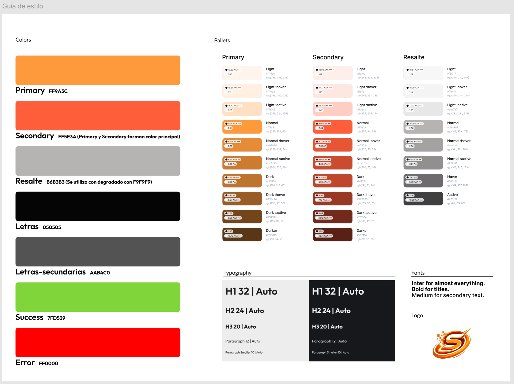
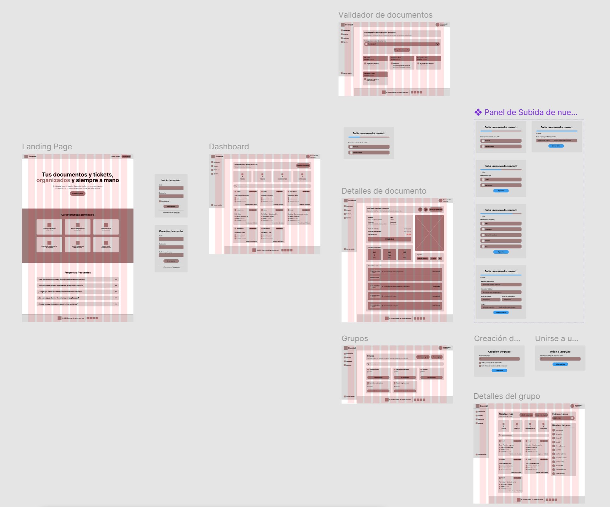
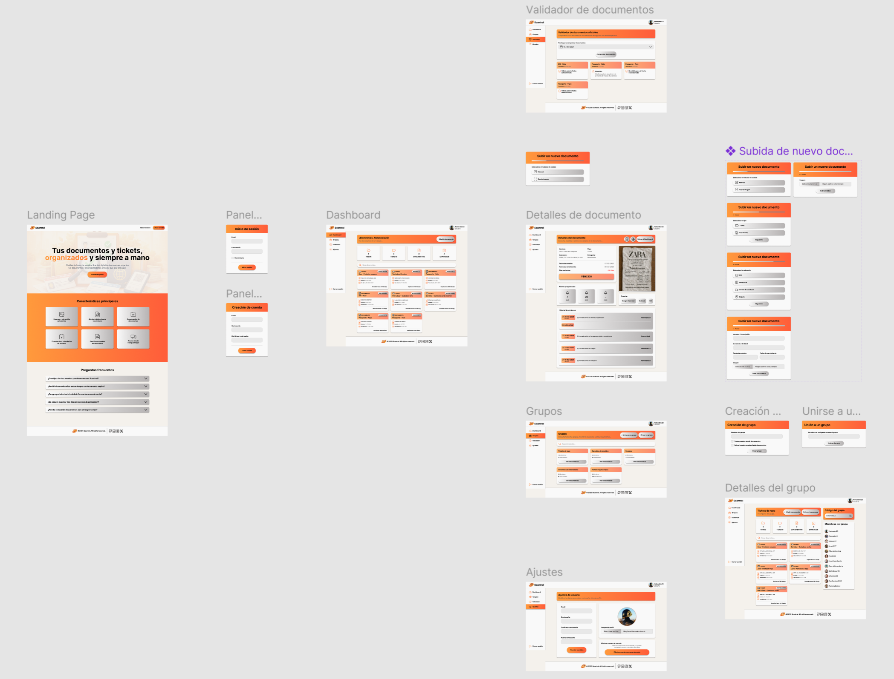
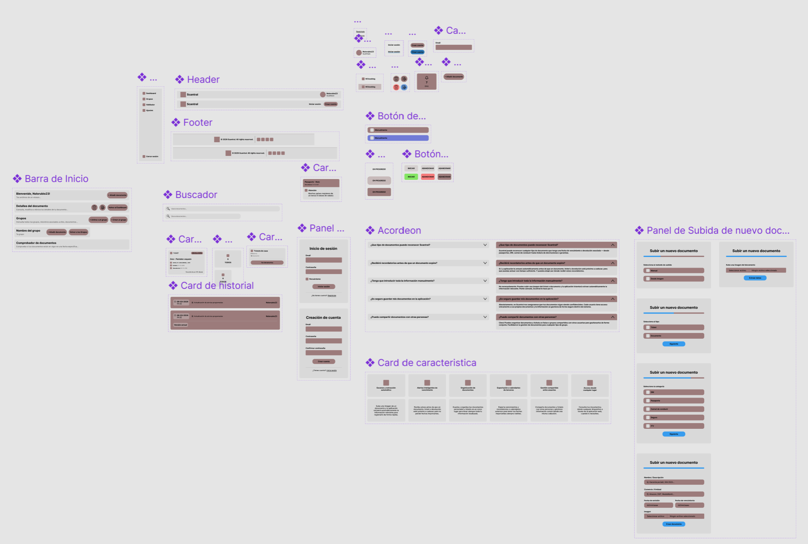
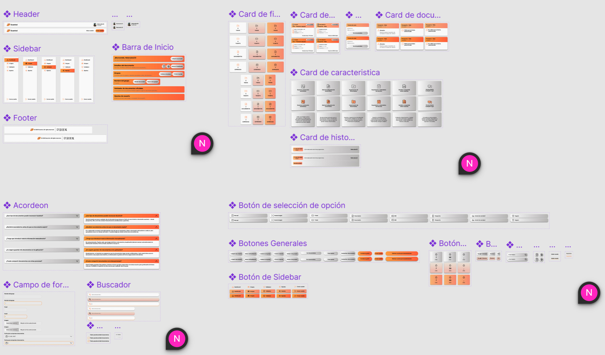

# 4. Guía de estilos y diseño de interfaz

## Índice

- [4.1. Prototipo en Figma](#41-prototipo-en-figma)
- [4.2. Guía de estilos](#42-guía-de-estilos)
  - [Paleta de colores](#paleta-de-colores)
  - [Tipografía](#tipografía)
  - [Espaciado](#espaciado)
- [4.3. Wireframes y mockups de las pantallas principales](#43-wireframes-y-mockups-de-las-pantallas-principales)
- [4.4. Componentes reutilizables](#44-componentes-reutilizables)

---

## 4.1. Prototipo en Figma

El diseño de Scantral se realizó íntegramente en Figma. Los enlaces de acceso son los siguientes:

| Recurso | Enlace |
|---|---|
| **Proyecto completo** | [Ver en Figma](https://www.figma.com/files/team/1552254663656061275/project/558404348?fuid=1552254659656102579) |
| **Fichero principal** | [Ver en Figma](https://www.figma.com/design/XS6oqxCcUzYrxzmrNU0OSP/Proyecto-principal?t=PUxqNLIMogn2N5bH-1) |

El fichero principal contiene páginas de diseño por pantalla, la biblioteca de componentes, la guía de estilos y prototipos navegables con los flujos completos de la aplicación.

---

## 4.2. Guía de estilos

### Paleta de colores

El color principal es un naranja cálido (#FF9A3C) y el secundario un rojo anaranjado (#FF5E3A), que juntos forman el gradiente corporativo. Se complementan con colores semánticos de estado (éxito, error, info, alerta), una escala de neutros de nueve pasos y tokens de superficie y texto distintos para los temas claro y oscuro.

### Tipografía

Se utiliza exclusivamente la familia **Inter**. La escala contempla tamaños desde 10 px hasta 32 px, cinco pesos (ligero, regular, medio, seminegrita y negrita) y tres alturas de línea adaptadas a la jerarquía del contenido.

### Espaciado

El sistema se basa en una cuadrícula de 8 px. Todos los márgenes y separaciones de la interfaz son múltiplos de esta unidad base. Los radios de borde van de 2 px a circular y el sistema de elevación define siete niveles de sombra.

---

## 4.3. Wireframes y mockups de las pantallas principales

Se diseñaron nueve pantallas: landing page, login y registro, dashboard, listado de documentos, detalle de documento, grupos, detalle de grupo, validador y ajustes de perfil.

**Wireframes**

**Mockups**

---

## 4.4. Componentes reutilizables

La biblioteca agrupa componentes de layout, formulario, documento, grupo, acción y navegación, y feedback. Cada componente tiene definidos sus estados (reposo, hover, activo, deshabilitado, error) y sus variantes de tema claro y oscuro.

**Componentes — Wireframe**

**Componentes — Mockup**

