# 5. Diseño

## Índice

- [5.1. Diagrama entidad-relación](#51-diagrama-entidad-relación)
  - [Entidades y atributos](#entidades-y-atributos)
  - [Relaciones](#relaciones)
- [5.2. Diagrama de casos de uso](#52-diagrama-de-casos-de-uso)
- [5.3. Diagramas de flujo de los procesos principales](#53-diagramas-de-flujo-de-los-procesos-principales)
  - [Flujo 1 — Subir documento de forma manual](#flujo-1--subir-documento-de-forma-manual)
  - [Flujo 2 — Subir documento mediante OCR / IA](#flujo-2--subir-documento-mediante-ocr--ia)
  - [Flujo 3 — Editar documento](#flujo-3--editar-documento)
  - [Flujo 4 — Eliminar documento](#flujo-4--eliminar-documento)
  - [Flujo 5 — Activar y crear alertas](#flujo-5--activar-y-crear-alertas)
  - [Flujo 6 — Consultar historial del documento](#flujo-6--consultar-historial-del-documento)
  - [Flujo 7 — Crear un grupo](#flujo-7--crear-un-grupo)
  - [Flujo 8 — Unirse a un grupo](#flujo-8--unirse-a-un-grupo)
  - [Flujo 9 — Añadir documento en un grupo](#flujo-9--añadir-documento-en-un-grupo)
  - [Flujo 10 — Eliminar un grupo](#flujo-10--eliminar-un-grupo)
  - [Flujo 11 — Validar documentos](#flujo-11--validar-documentos)
  - [Flujo 12 — Ajustes del usuario](#flujo-12--ajustes-del-usuario)
  - [Flujo 13 — Eliminar cuenta de usuario](#flujo-13--eliminar-cuenta-de-usuario)
- [5.4. Arquitectura de la aplicación](#54-arquitectura-de-la-aplicación)
  - [Visión general](#visión-general)
  - [Frontend — Angular SPA](#frontend--angular-spa)
  - [Backend — Spring Boot API](#backend--spring-boot-api)
  - [Servicio OCR — PaddleOCR sidecar](#servicio-ocr--paddleocr-sidecar)
  - [Base de datos — PostgreSQL](#base-de-datos--postgresql)
  - [Comunicación entre capas](#comunicación-entre-capas)
- [5.5. Diseño de la API REST](#55-diseño-de-la-api-rest)
  - [Autenticación](#autenticación)
  - [Documentos](#documentos)
  - [Alertas de documentos](#alertas-de-documentos)
  - [Grupos](#grupos)
  - [Usuarios](#usuarios)
  - [Dashboard](#dashboard)
  - [Procesamiento de imágenes](#procesamiento-de-imágenes)
  - [Administración](#administración)
  - [Convenciones generales](#convenciones-generales)

---

## 5.1. Diagrama entidad-relación

A continuación se describe el modelo de datos real tal como está implementado en la base de datos PostgreSQL, mapeado mediante JPA/Hibernate.

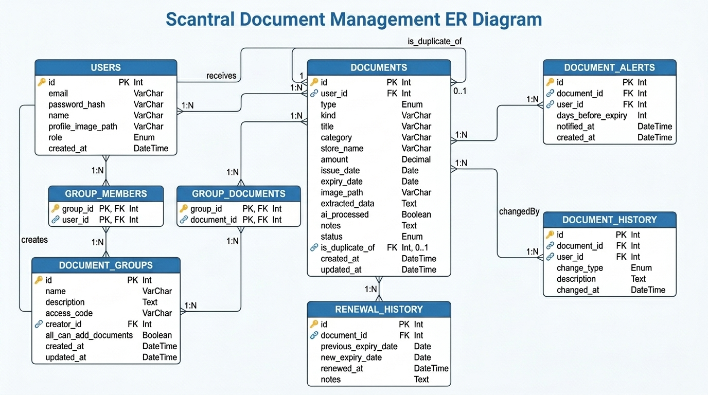
_Diagrama entidad-relación completo de la base de datos de Scantral._

---

### Entidades y atributos

**User** — tabla `users`

| Campo | Tipo | Restricciones |
|---|---|---|
| id | bigint | PK, auto-increment |
| email | varchar | NOT NULL, UNIQUE |
| password_hash | varchar | NOT NULL |
| name | varchar | NOT NULL |
| profile_image_path | varchar | nullable |
| role | varchar | NOT NULL, default `USER`; enum: `USER`, `ADMIN` |
| created_at | datetime | NOT NULL, inmutable |

---

**Document** — tabla `documents`

| Campo | Tipo | Restricciones |
|---|---|---|
| id | bigint | PK, auto-increment |
| user_id | bigint | FK → users, NOT NULL |
| type | varchar | NOT NULL; enum: `DNI`, `PASSPORT`, `DRIVING_LICENSE`, `INSURANCE`, `ITV`, `RECEIPT`, `WARRANTY`, `INVOICE`, `OTHER` |
| kind | varchar | nullable (ticket / documento oficial) |
| title | varchar | NOT NULL |
| category | varchar | nullable |
| store_name | varchar | nullable |
| amount | decimal(10,2) | nullable |
| issue_date | date | nullable |
| expiry_date | date | nullable |
| image_path | varchar | nullable |
| extracted_data | text | nullable (JSON con datos extraídos por OCR/IA) |
| ai_processed | boolean | default false |
| notes | text | nullable |
| status | varchar | NOT NULL, default `ACTIVE`; enum: `ACTIVE`, `EXPIRING_SOON`, `EXPIRED`, `RENEWED` |
| is_duplicate_of | bigint | FK → documents (auto-referencia), nullable |
| created_at | datetime | NOT NULL, inmutable |
| updated_at | datetime | nullable |

---

**DocumentAlert** — tabla `document_alerts`

| Campo | Tipo | Restricciones |
|---|---|---|
| id | bigint | PK, auto-increment |
| document_id | bigint | FK → documents, NOT NULL |
| user_id | bigint | FK → users, NOT NULL |
| days_before_expiry | int | NOT NULL |
| notified_at | datetime | nullable (fecha del último envío) |
| created_at | datetime | NOT NULL, inmutable |

Constraint única: `(document_id, user_id, days_before_expiry)` — no se puede crear la misma alerta dos veces para el mismo documento y usuario.

---

**DocumentHistory** — tabla `document_history`

| Campo | Tipo | Restricciones |
|---|---|---|
| id | bigint | PK, auto-increment |
| document_id | bigint | FK → documents, NOT NULL |
| user_id | bigint | FK → users (changedBy), NOT NULL |
| change_type | varchar | NOT NULL; enum: `CREATED`, `UPDATED`, `IMAGE_UPLOADED`, `RENEWED`, `DATES_UPDATED` |
| description | text | nullable |
| changed_at | datetime | NOT NULL, inmutable |

---

**RenewalHistory** — tabla `renewal_history`

| Campo | Tipo | Restricciones |
|---|---|---|
| id | bigint | PK, auto-increment |
| document_id | bigint | FK → documents, NOT NULL |
| previous_expiry_date | date | NOT NULL |
| new_expiry_date | date | NOT NULL |
| renewed_at | datetime | NOT NULL |
| notes | text | nullable |

---

**DocumentGroup** — tabla `document_groups`

| Campo | Tipo | Restricciones |
|---|---|---|
| id | bigint | PK, auto-increment |
| name | varchar | NOT NULL |
| description | varchar | nullable |
| access_code | varchar(10) | UNIQUE |
| creator_id | bigint | FK → users, NOT NULL |
| all_can_add_documents | boolean | NOT NULL, default true |
| created_at | datetime | NOT NULL, inmutable |
| updated_at | datetime | nullable |

---

**group_members** — tabla de unión N:M (User ↔ DocumentGroup)

| Campo | Tipo |
|---|---|
| group_id | bigint (FK → document_groups) |
| user_id | bigint (FK → users) |

---

**group_documents** — tabla de unión N:M (Document ↔ DocumentGroup)

| Campo | Tipo |
|---|---|
| group_id | bigint (FK → document_groups) |
| document_id | bigint (FK → documents) |

---

### Relaciones

```
User           1 ──< N   Document
User           1 ──< N   DocumentAlert
User           1 ──< N   DocumentHistory   (changedBy)
User           N >──< N  DocumentGroup     (via group_members)
Document       1 ──< N   DocumentAlert
Document       1 ──< N   DocumentHistory
Document       1 ──< N   RenewalHistory
Document       0..1 ──   Document          (is_duplicate_of, auto-referencia)
Document       N >──< N  DocumentGroup     (via group_documents)
DocumentGroup  N ──< 1   User              (creator_id)
```

---

## 5.2. Diagrama de casos de uso

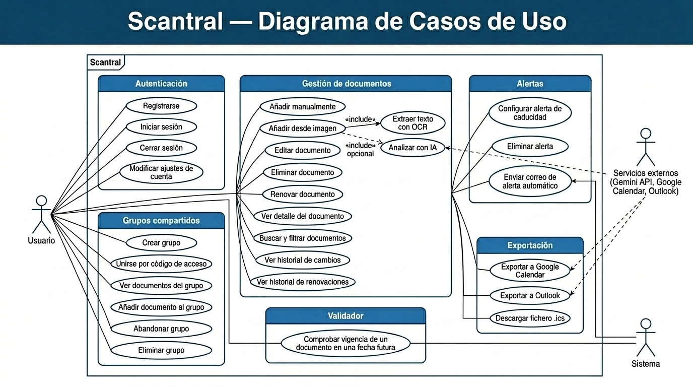
_Diagrama de casos de uso con los tres actores y todas las funcionalidades del sistema._

> **Diagrama de casos de uso (formato Mermaid).** El bloque de código siguiente es la representación textual del diagrama. Se visualiza correctamente en **GitHub**, **GitLab**, **VS Code** (con la extensión Markdown Preview Mermaid Support) y cualquier visor de Markdown con soporte para Mermaid.

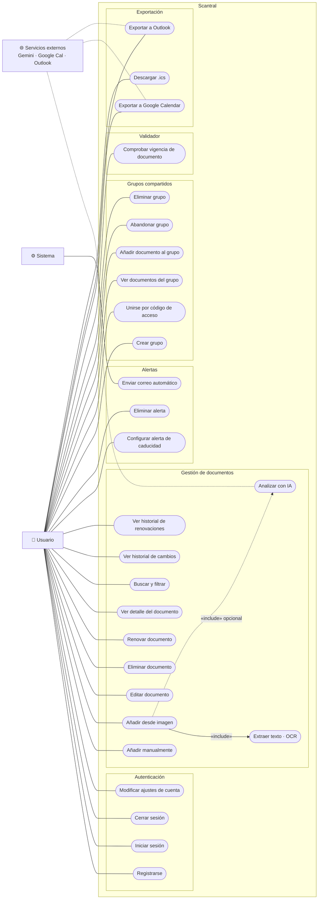
_Diagrama de casos de uso con los tres actores y todas las funcionalidades del sistema._

### Actores

- **Usuario** — actor principal. Representa a cualquier persona registrada en la aplicación.
- **Sistema** — actor secundario interno. Representa las tareas programadas del backend, como el envío automático de alertas por correo.
- **Servicios externos** — actor secundario externo. Engloba Gemini API (extracción IA), Google Calendar y Outlook (exportación de recordatorios).

### Casos de uso por módulo

**Autenticación**
- Registrarse
- Iniciar sesión
- Cerrar sesión
- Modificar ajustes de cuenta (nombre, contraseña, imagen de perfil, API key de Gemini, tema)

**Gestión de documentos**
- Añadir documento manualmente
- Añadir documento desde imagen *(incluye: Extraer texto con OCR; incluye opcionalmente: Analizar con IA)*
- Editar documento
- Eliminar documento
- Renovar documento
- Ver detalle del documento
- Buscar y filtrar documentos
- Ver historial de cambios
- Ver historial de renovaciones

**Alertas**
- Configurar alerta de caducidad (días antes de vencimiento)
- Eliminar alerta
- *(Sistema)* Enviar correo de alerta automáticamente

**Grupos compartidos**
- Crear grupo
- Unirse a grupo mediante código de acceso
- Ver documentos del grupo
- Añadir documento a un grupo
- Abandonar grupo
- Eliminar grupo *(solo creador)*

**Validador**
- Comprobar vigencia de un documento en una fecha futura

**Exportación**
- Exportar recordatorio a Google Calendar
- Exportar recordatorio a Outlook
- Descargar fichero `.ics`

---

## 5.3. Diagramas de flujo de los procesos principales

### Flujo 1 — Subir documento de forma manual

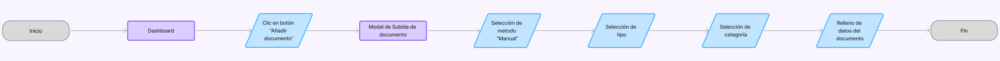

El usuario accede al asistente de creación de documentos y elige la opción de introducción manual. Rellena el formulario paso a paso: primero el tipo de documento (ticket o documento oficial), después la categoría, y finalmente los campos de detalle como título, fechas o importe. El sistema valida los campos obligatorios antes de persistir el documento y redirige al usuario a la vista de detalle una vez guardado.

---

### Flujo 2 — Subir documento mediante OCR / IA

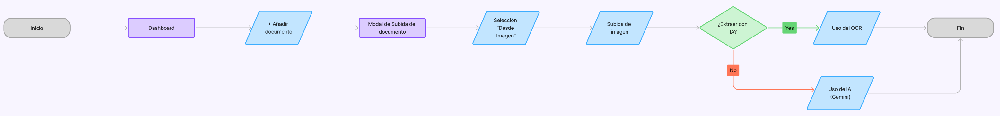

El usuario elige la opción «Desde imagen» en el asistente. Sube una fotografía o escáner del documento y el backend la envía al sidecar de PaddleOCR para extraer el texto de forma local. Si la extracción tiene éxito, los campos del formulario se pre-rellenan automáticamente. Si el usuario marca la opción de usar IA, se realiza adicionalmente una llamada a la API de Gemini, que puede enriquecer o corregir los datos obtenidos por OCR. En ambos casos el usuario revisa y confirma el resultado antes de guardar.

---

### Flujo 3 — Editar documento

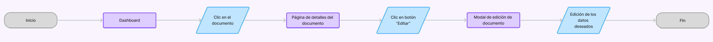

Desde el detalle de un documento, el usuario pulsa «Editar» para abrir el formulario de modificación con los datos actuales pre-cargados. Puede cambiar cualquier campo, incluida la imagen asociada. Al guardar, el backend actualiza el registro y registra automáticamente una entrada en el historial de cambios (`DocumentHistory`) con el tipo `UPDATED`.

---

### Flujo 4 — Eliminar documento

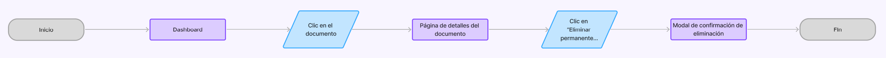

El usuario selecciona la opción de eliminar desde el detalle o el listado de documentos. El sistema muestra un diálogo de confirmación para evitar borrados accidentales. Tras confirmar, el backend elimina el documento junto con sus alertas, historial y registros de renovación asociados gracias a la cascada de eliminación definida en las entidades JPA.

---

### Flujo 5 — Activar y crear alertas

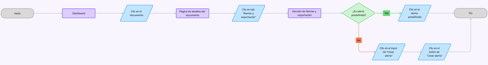

Desde el detalle de un documento, el usuario puede configurar una o varias alertas indicando cuántos días antes de la fecha de caducidad quiere ser notificado. El backend valida que no exista ya una alerta con el mismo número de días para ese documento y usuario antes de crearla. Una tarea programada diaria comprueba las alertas activas y envía un correo automáticamente cuando se alcanza el umbral, registrando la fecha de envío para no volver a notificar en el mismo día.

---

### Flujo 6 — Consultar historial del documento

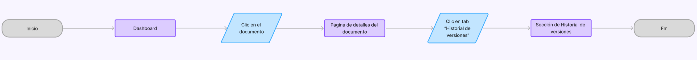

El usuario accede al detalle de un documento y navega a la pestaña de historial. El sistema muestra de forma cronológica todas las acciones registradas sobre ese documento: creación, ediciones, subidas de imagen, renovaciones y actualizaciones de fechas. Cada entrada incluye el tipo de cambio, la descripción y la fecha exacta en que se realizó.

---

### Flujo 7 — Crear un grupo

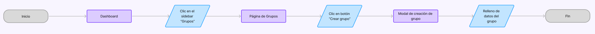

El usuario accede a la sección de grupos y pulsa «Crear grupo». Introduce un nombre y los permisos que van a tener esos usuarios. Al confirmar, el backend crea el grupo, asigna al usuario como creador y genera automáticamente un código de acceso único de 10 caracteres que podrá compartir con otros usuarios para que se unan.

---

### Flujo 8 — Unirse a un grupo

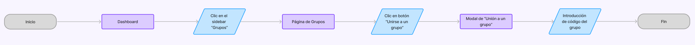

El usuario selecciona la opción «Unirse a un grupo» e introduce el código de acceso que le ha proporcionado el creador. El backend verifica que el código existe y que el usuario no es ya miembro del grupo. Si todo es correcto, lo añade como miembro y le concede acceso a los documentos compartidos del grupo.

---

### Flujo 9 — Añadir documento en un grupo

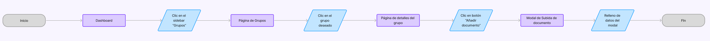

Desde la vista de detalle de un grupo, un miembro con permisos de escritura puede añadir un nuevo documento directamente al grupo. El flujo es equivalente al de subida individual (manual o desde imagen con OCR/IA), con la diferencia de que el documento queda vinculado tanto al usuario que lo sube como al grupo, apareciendo en la biblioteca compartida del grupo.

---

### Flujo 10 — Eliminar un grupo

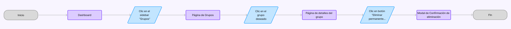

Solo el creador del grupo puede eliminarlo. Desde los ajustes del grupo, pulsa «Eliminar grupo» y confirma la acción. El backend elimina el grupo y todas sus relaciones con miembros y documentos.

---

### Flujo 11 — Validar documentos

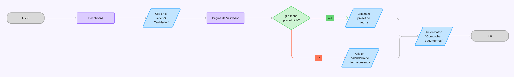

El usuario accede al validador y elige una fecha de referencia (mediante un preset como «hoy», «+6 meses», «+1 año» o «+2 años», o introduciendo una fecha concreta en el calendario). El frontend compara las fechas de caducidad de los documentos seleccionados con la fecha indicada y muestra el resultado con código de color: verde si el documento estará vigente, rojo si habrá caducado, y un aviso diferenciado si el documento no tiene fecha de caducidad.

---

### Flujo 12 — Ajustes del usuario

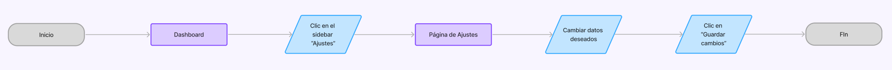

Desde la sección de ajustes, el usuario puede modificar su nombre de usuario, email, cambiar su contraseña y subir o reemplazar su imagen de perfil. Cada tipo de cambio se procesa de forma independiente: el backend actualiza solo los campos modificados y valida las reglas de negocio pertinentes (por ejemplo, que la contraseña actual sea correcta antes de permitir el cambio).

---

### Flujo 13 — Eliminar cuenta de usuario

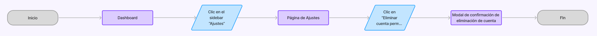

El usuario accede a los ajustes de cuenta y solicita la eliminación de su perfil. El sistema muestra un diálogo de confirmación advirtiendo de que la acción es irreversible. Tras confirmar, el backend elimina el usuario y, en cascada, todos sus documentos, alertas, historial y membresías en grupos. Si el usuario era el creador de algún grupo, ese grupo también se elimina.

---

## 5.4. Arquitectura de la aplicación

### Visión general

Scantral sigue una arquitectura cliente-servidor clásica compuesta por tres servicios desplegados mediante Docker Compose. Cada servicio tiene una responsabilidad única y se comunica con los demás a través de protocolos bien definidos.

```
┌─────────────────────────────────────────────────────────┐
│                     CLIENTE (navegador)                  │
│              Angular SPA  ·  puerto 4200 / 80            │
└──────────────────────────┬──────────────────────────────┘
                           │ HTTP/REST (JSON)
                           ▼
┌─────────────────────────────────────────────────────────┐
│              BACKEND  (Spring Boot 4 · Java 21)          │
│                       puerto 8080                        │
│                                                          │
│  AuthController  DocumentController  GroupController     │
│  UserController  DashboardController  AlertController    │
│  DocumentProcessingController  AdminController           │
│                                                          │
│  ┌──────────────┐  ┌─────────────────┐  ┌────────────┐  │
│  │   Services   │  │  Security (JWT) │  │ Scheduler  │  │
│  └──────────────┘  └─────────────────┘  └────────────┘  │
│  ┌──────────────────────────────────────────────────┐    │
│  │            JPA / Hibernate                        │    │
│  └──────────────────────────────────────────────────┘    │
└────────┬─────────────────────────────┬───────────────────┘
         │ JDBC                        │ HTTP (multipart)
         ▼                             ▼
┌─────────────────┐        ┌──────────────────────────────┐
│   PostgreSQL    │        │  PaddleOCR sidecar (Python)  │
│   puerto 5432   │        │         puerto 8001           │
└─────────────────┘        └──────────────────────────────┘
```

### Frontend — Angular SPA

La interfaz de usuario es una Single Page Application construida con **Angular 20**. Usa componentes standalone, el router propio de Angular para la navegación entre vistas y señales reactivas (`Signal`) para la gestión de estado local. Las peticiones al backend se realizan a través de `HttpClient` con interceptores para inyectar automáticamente el token JWT en cada cabecera `Authorization`.

Las rutas principales de la aplicación son:

| Ruta | Componente | Descripción | Guard |
|---|---|---|---|
| `/` | `LandingComponent` | Página de inicio pública | `authRedirectGuard` |
| `/login` | `LoginComponent` | Formulario de inicio de sesión | — |
| `/register` | `RegisterComponent` | Formulario de registro | — |
| `/dashboard` | `DashboardComponent` | Vista principal de documentos | `authGuard` |
| `/documents/:id` | `DocumentDetailComponent` | Detalle de un documento | `authGuard` |
| `/groups` | `GroupsComponent` | Listado de grupos | `authGuard` |
| `/groups/:id` | `GroupDetailComponent` | Detalle de un grupo | `authGuard` |
| `/validator` | `ValidatorComponent` | Validador de vigencia | `authGuard` |
| `/settings` | `SettingsComponent` | Ajustes de cuenta | `authGuard` |

La aplicación cuenta con dos guards funcionales de Angular Router:

- **`authGuard`** (`guards/auth.guard.ts`) — protege las rutas privadas. Si el usuario no tiene sesión activa redirige automáticamente a `/` (landing page).
- **`authRedirectGuard`** (`guards/auth-redirect.guard.ts`) — protege las rutas públicas frente a usuarios ya autenticados. Si el usuario tiene sesión activa redirige automáticamente a `/dashboard`.

### Backend — Spring Boot API

El backend está construido con **Spring Boot 4** y **Java 21**. Expone una API REST que consume el frontend. La capa de seguridad usa Spring Security con autenticación basada en JWT: cada petición autenticada lleva el token en la cabecera `Authorization: Bearer <token>`. Los tokens revocados (por cierre de sesión) se añaden a una lista negra en memoria hasta que caducan.

La estructura interna del backend sigue una arquitectura en capas:

- **Controller** — recibe la petición HTTP, valida la entrada y delega en el servicio correspondiente.
- **Service** — contiene la lógica de negocio. Es la única capa que accede al repositorio.
- **Repository** — interfaces JPA que encapsulan el acceso a PostgreSQL.
- **DTO** — objetos de transferencia de datos para las peticiones y respuestas de la API.
- **Model** — entidades JPA que mapean las tablas de la base de datos.
- **Security** — filtros JWT, `UserDetailsService`, configuración de CORS y rate limiting.

El backend también incluye una tarea `@Scheduled` en el `DocumentAlertService` que se ejecuta diariamente para enviar los correos de alerta de caducidad.

### Servicio OCR — PaddleOCR sidecar

El servicio de reconocimiento óptico de caracteres es un microservicio independiente escrito en **Python** con **FastAPI** que envuelve la librería **PaddleOCR**. Se ejecuta en el mismo entorno Docker que el backend y escucha en el puerto 8001.

El backend le envía la imagen del documento como `multipart/form-data` a `POST /ocr`. El sidecar devuelve el texto extraído en formato JSON. Al tratarse de un servicio local, las imágenes de los usuarios nunca salen del entorno de despliegue durante la extracción primaria, lo que garantiza la privacidad por diseño.

Si el sidecar no está disponible o devuelve un error, el pipeline del backend continúa sin OCR y usa los datos que tenga disponibles (o los de Gemini si está activado).

### Base de datos — PostgreSQL

Los datos se persisten en una base de datos **PostgreSQL**. El esquema lo gestiona Hibernate con `ddl-auto=update`, lo que significa que las tablas se crean o actualizan automáticamente al arrancar el backend si hay cambios en las entidades.

Los ficheros de imagen subidos por los usuarios se almacenan en un volumen de disco local montado en el contenedor del backend (`./uploads`), no en la base de datos.

### Comunicación entre capas

| Origen | Destino | Protocolo | Formato |
|---|---|---|---|
| Navegador | Backend | HTTP/HTTPS | JSON / multipart |
| Backend | PostgreSQL | JDBC | SQL |
| Backend | PaddleOCR sidecar | HTTP interno (Docker network) | multipart → JSON |
| Backend | Gemini API (opcional) | HTTPS | JSON |
| Backend | Resend API | HTTPS | JSON |

---

## 5.5. Diseño de la API REST

Todos los endpoints (salvo los de autenticación y la imagen de perfil) requieren autenticación mediante el header `Authorization: Bearer <token>`. Los errores siguen el formato estándar de Spring Boot con campos `timestamp`, `status`, `error` y `message`.

### Autenticación

Base URL: `/api/auth`

| Método | Endpoint | Auth | Body | Respuesta | Descripción |
|---|---|:---:|---|---|---|
| POST | `/register` | ❌ | `{ email, password, name }` | `201 AuthResponse` | Registra un nuevo usuario |
| POST | `/login` | ❌ | `{ email, password }` | `200 AuthResponse` | Inicia sesión y devuelve JWT |
| POST | `/logout` | ✅ | — | `204 No Content` | Invalida el token actual |

**AuthResponse:**
```json
{
  "userId": 1,
  "email": "usuario@email.com",
  "name": "Nombre",
  "profileImagePath": "/uploads/...",
  "role": "USER",
  "token": "eyJ..."
}
```

---

### Documentos

Base URL: `/api/documents`

| Método | Endpoint | Auth | Descripción |
|---|---|:---:|---|
| GET | `/` | ✅ | Lista todos los documentos del usuario |
| GET | `/search` | ✅ | Búsqueda paginada con filtros (`status`, `type`, `q`, `page`, `size`, `sort`) |
| GET | `/{id}` | ✅ | Obtiene el detalle de un documento |
| POST | `/` | ✅ | Crea un documento (multipart: `data` + `file` opcional) |
| PUT | `/{id}` | ✅ | Actualiza un documento (multipart: `data` + `file` opcional) |
| DELETE | `/{id}` | ✅ | Elimina un documento |
| POST | `/{id}/renew` | ✅ | Renueva un documento (`?newExpiryDate=YYYY-MM-DD`) |
| GET | `/{id}/renewals` | ✅ | Historial de renovaciones del documento |
| GET | `/{id}/history` | ✅ | Historial de cambios del documento |
| POST | `/{id}/image` | ✅ | Sube o reemplaza la imagen de un documento |
| POST | `/check-duplicates` | ✅ | Comprueba si existe un documento duplicado |
| POST | `/extract` | ✅ | Extrae datos de una imagen sin crear el documento |

**DocumentResponse:**
```json
{
  "id": 1,
  "type": "DNI",
  "title": "DNI - Manolo",
  "category": null,
  "storeName": null,
  "amount": null,
  "issueDate": "2020-01-15",
  "expiryDate": "2030-01-15",
  "daysRemaining": 1345,
  "imagePath": "/uploads/...",
  "aiProcessed": false,
  "notes": null,
  "status": "ACTIVE",
  "duplicateOfId": null,
  "createdAt": "2025-01-10T10:00:00",
  "updatedAt": null
}
```

---

### Alertas de documentos

Base URL: `/api/documents/{documentId}/alerts`

| Método | Endpoint | Auth | Body | Respuesta | Descripción |
|---|---|:---:|---|---|---|
| GET | `/` | ✅ | — | `200 List<AlertResponse>` | Lista las alertas del documento |
| POST | `/` | ✅ | `{ daysBeforeExpiry }` | `201 AlertResponse` | Crea una alerta |
| DELETE | `/{alertId}` | ✅ | — | `204 No Content` | Elimina una alerta |

**DocumentAlertResponse:**
```json
{
  "id": 3,
  "documentId": 1,
  "daysBeforeExpiry": 30,
  "notifiedAt": null,
  "createdAt": "2025-01-10T10:00:00"
}
```

---

### Grupos

Base URL: `/api/groups`

| Método | Endpoint | Auth | Body | Respuesta | Descripción |
|---|---|:---:|---|---|---|
| GET | `/` | ✅ | — | `200 List<GroupResponse>` | Lista los grupos del usuario |
| POST | `/` | ✅ | `{ name, description }` | `201 GroupResponse` | Crea un grupo |
| GET | `/{id}` | ✅ | — | `200 GroupResponse` | Obtiene un grupo |
| GET | `/{id}/detail` | ✅ | — | `200 GroupDetailResponse` | Detalle completo con miembros |
| DELETE | `/{id}` | ✅ | — | `204 No Content` | Elimina un grupo (solo creador) |
| POST | `/join` | ✅ | `{ accessCode }` | `200 GroupResponse` | Unirse a un grupo por código |
| DELETE | `/{id}/leave` | ✅ | — | `204 No Content` | Abandonar un grupo |
| GET | `/{id}/documents` | ✅ | — | `200 List<DocumentResponse>` | Documentos del grupo |
| POST | `/{id}/documents` | ✅ | multipart: `data` + `file` | `201 DocumentResponse` | Añade un documento al grupo |
| POST | `/{id}/documents/extract` | ✅ | multipart: `file` + `?useAi` | `201 DocumentResponse` | Extrae y añade desde imagen |

**GroupResponse:**
```json
{
  "id": 2,
  "name": "Familia García",
  "creatorId": 1,
  "allCanAddDocuments": true,
  "memberCount": 3,
  "documentCount": 7,
  "activeDocumentCount": 5,
  "expiredDocumentCount": 1,
  "memberPreviews": [...],
  "createdAt": "2025-02-01T09:00:00",
  "updatedAt": null
}
```

---

### Usuarios

Base URL: `/api/users`

| Método | Endpoint | Auth | Descripción |
|---|---|:---:|---|
| GET | `/{userId}` | ✅ | Obtiene los datos de un usuario (solo propio o admin) |
| PATCH | `/{userId}` | ✅ | Actualiza datos del usuario (nombre, contraseña, API key, tema) |
| DELETE | `/{userId}` | ✅ | Elimina la cuenta (solo propio o admin) |
| GET | `/{userId}/profile-image` | ❌ | Obtiene la imagen de perfil (pública, usada en ``) |
| POST | `/{userId}/profile-image` | ✅ | Sube o reemplaza la imagen de perfil |

---

### Dashboard

Base URL: `/api/dashboard`

| Método | Endpoint | Auth | Respuesta | Descripción |
|---|---|:---:|---|---|
| GET | `/` | ✅ | `200 DashboardStats` | Estadísticas resumidas del usuario |

**DashboardStats:**
```json
{
  "totalDocuments": 12,
  "activeDocuments": 8,
  "expiringSoonDocuments": 2,
  "expiredDocuments": 2
}
```

---

### Procesamiento de imágenes

Base URL: `/api/documents/processing`

| Método | Endpoint | Auth | Body | Respuesta | Descripción |
|---|---|:---:|---|---|---|
| POST | `/analyze` | ❌* | multipart: `file` | `200 ProcessDocumentResponse` | Ejecuta el pipeline OCR+IA sobre una imagen |

> \* Este endpoint es llamado internamente por el propio backend durante la creación de documentos. No requiere autenticación propia porque se usa desde la capa de servicio.

---

### Administración

Base URL: `/api/admin` *(requiere rol `ADMIN`)*

| Método | Endpoint | Auth | Descripción |
|---|---|:---:|---|
| GET | `/users` | ✅ ADMIN | Listado paginado y filtrable de usuarios (`role`, `q`, `page`, `size`, `sort`) |

---
