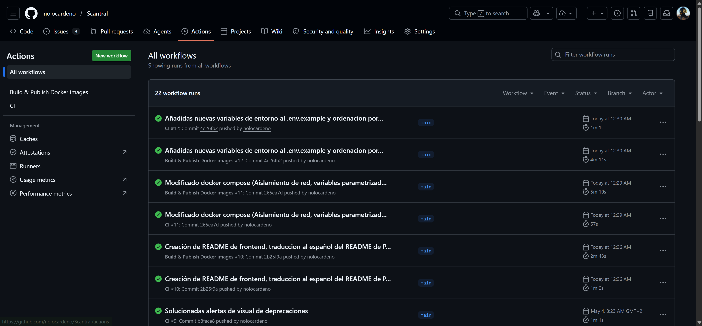
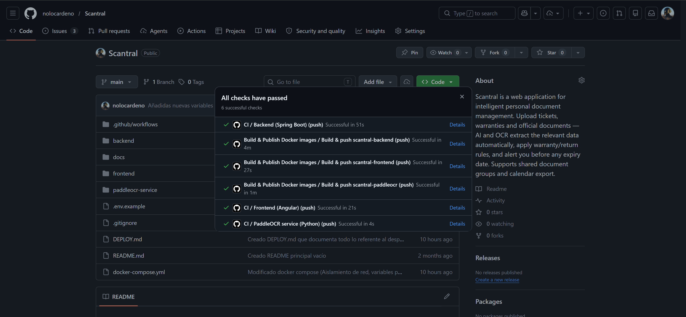
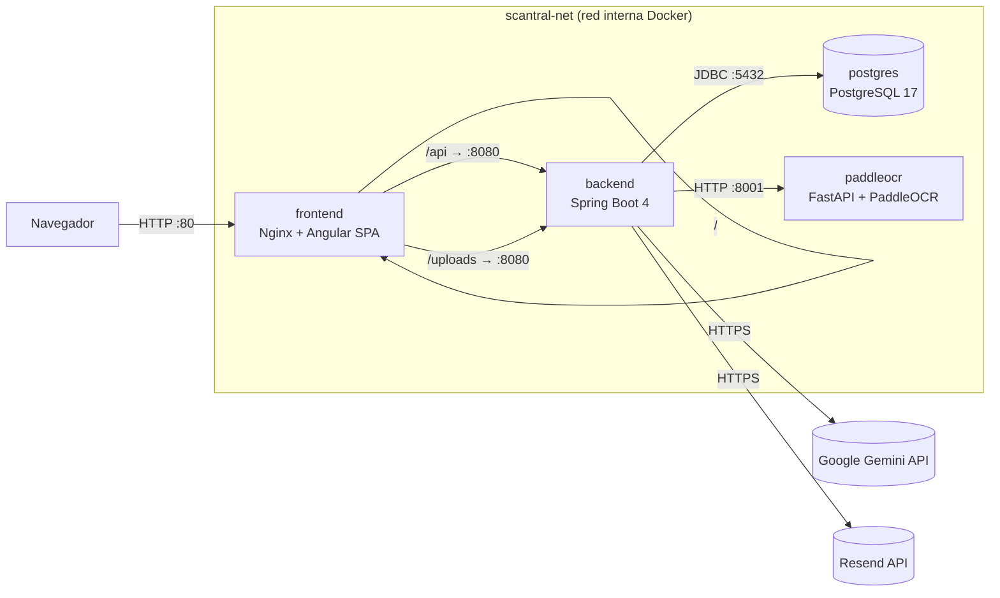
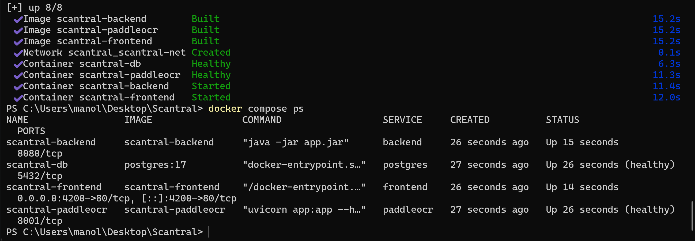

# Documentación de despliegue — evaluación

Esta guía está organizada siguiendo los criterios de la rúbrica de evaluación.
Cada sección incluye la evidencia específica que permite verificar y reproducir
el despliegue sin ayuda externa.

---

## Índice

- [c6 — Documentación del proyecto](#c6--documentación-del-proyecto)
- [c5 — Control de versiones y CI/CD](#c5--control-de-versiones-y-cicd)
- [c1 — Arquitectura de la aplicación](#c1--arquitectura-de-la-aplicación)
- [c2 — Implementación en Docker](#c2--implementación-en-docker)
- [c3 — Servidor web como front (reverse proxy)](#c3--servidor-web-como-front-reverse-proxy)
- [c4 — Servidor de aplicaciones (backend)](#c4--servidor-de-aplicaciones-backend)
- [C7 — Gestión de ficheros y artefactos](#c7--gestión-de-ficheros-y-artefactos)
- [C8 — Verificación de red del despliegue](#c8--verificación-de-red-del-despliegue)

---

## c6 — Documentación del proyecto

### Qué es Scantral

Aplicación web que permite gestionar documentos personales (DNI, pasaporte, ITV,
seguros, recibos, garantías…), avisando de su caducidad y extrayendo datos
automáticamente de fotografías mediante un pipeline IA + OCR.

### Estructura de documentación del repositorio

| Fichero / carpeta | Contenido |
| --- | --- |
| [README.md](../README.md) | Qué hace el proyecto, requisitos, arranque rápido, arquitectura, CI/CD, HTTPS |
| [DEPLOY.md](../DEPLOY.md) | Guía paso a paso de despliegue local y en remoto, variables de entorno, troubleshooting completo |
| [docs/](../docs/) | Documentación técnica extendida (introducción, diseño, desarrollo, pruebas, despliegue) |
| [docs/08-despliegue.md](08-despliegue.md) | Despliegue con diagrama de arquitectura, CI/CD, proceso de producción |
| Este fichero | Documentación orientada a la rúbrica de evaluación |

### API documentada con Swagger/OpenAPI

El backend genera automáticamente la especificación OpenAPI 3.1 con Springdoc.
Nginx la expone a través del reverse proxy sin necesidad de publicar el puerto
8080 del backend:

| Recurso | URL local | URL producción |
| --- | --- | --- |
| Swagger UI | <http://localhost/swagger-ui/index.html> | <https://scantral.com/swagger-ui/index.html> |
| OpenAPI JSON | <http://localhost/v3/api-docs> | <https://scantral.com/v3/api-docs> |

**Endpoints principales con ejemplos reales (`curl`):**

```bash
# ── Autenticación ─────────────────────────────────────────────────────────

# Registro de usuario
curl -s -X POST http://localhost/api/auth/register \
  -H "Content-Type: application/json" \
  -d '{"name":"Demo","email":"demo@scantral.local","password":"Demo1234!"}'
# → {"id":1,"name":"Demo","email":"demo@scantral.local"}

# Login → obtiene token JWT
TOKEN=$(curl -s -X POST http://localhost/api/auth/login \
  -H "Content-Type: application/json" \
  -d '{"email":"demo@scantral.local","password":"Demo1234!"}' \
  | python -c "import sys,json;print(json.load(sys.stdin)['token'])")

# ── Documentos ────────────────────────────────────────────────────────────

# Listar documentos del usuario autenticado
curl -s http://localhost/api/documents \
  -H "Authorization: Bearer $TOKEN"
# → [{"id":1,"name":"DNI","expiryDate":"2030-01-01",...}, ...]

# Subir imagen de un documento (multipart)
curl -s -X POST http://localhost/api/documents \
  -H "Authorization: Bearer $TOKEN" \
  -F "file=@/ruta/imagen.jpg" \
  -F "name=DNI"
# → {"id":2,"name":"DNI","extractedData":{...}}

# ── Códigos de respuesta comunes ──────────────────────────────────────────
# 200 OK       — operación exitosa
# 201 Created  — recurso creado
# 400 Bad Request — datos inválidos / validación fallida
# 401 Unauthorized — token ausente, expirado o inválido
# 403 Forbidden — no tiene permisos sobre ese recurso
# 429 Too Many Requests — rate-limit superado (10 req/min en /api/auth/login)
# 500 Internal Server Error — error inesperado del servidor
```

---

## c5 — Control de versiones y CI/CD

### Uso de Git

El proyecto sigue un flujo de ramas estructurado:

- **`main`** — rama estable; sólo recibe merges revisados.
- **`develop`** — integración continua de features.
- **`feature/<nombre>`** — cada funcionalidad en su propia rama.
- **`fix/<nombre>`** — correcciones de bugs.

Los commits siguen el formato [Conventional Commits](https://www.conventionalcommits.org/)
(`feat:`, `fix:`, `refactor:`, `docs:`, `test:`, `ci:`, `chore:`).

Repositorio público: **<https://github.com/nolocardeno/Scantral>**

### Workflows de GitHub Actions

#### CI — [`.github/workflows/ci.yml`](../.github/workflows/ci.yml)

Se activa en cada `push` y `pull_request` a `main`. Ejecuta **3 jobs en
paralelo**, uno por capa del stack:

```yaml
on:
  push:
    branches: [main]
  pull_request:
    branches: [main]

jobs:
  backend:         # Spring Boot: levanta Postgres 17 como service container y ejecuta ./mvnw -B verify
  frontend:        # Angular: npm ci + ng build --configuration production
  ocr:             # Python: python -m py_compile app.py
```

**Job `backend` (detalle):** levanta un contenedor Postgres 17 con
healthcheck como service container, configura JDK 21 (Temurin) con caché Maven
y ejecuta `./mvnw -B verify`, que compila, corre los 94 tests y aplica el
gate JaCoCo ≥ 80 % de cobertura.

**Job `frontend`:** `npm ci` (instalación reproducible con `package-lock.json`) +
`ng build --configuration production` (detecta errores de compilación TypeScript
y plantillas).

**Job `ocr`:** verifica la sintaxis del servicio PaddleOCR sin instalar sus
dependencias pesadas (~1 GB), manteniendo el job rápido.

#### CD — [`.github/workflows/docker-publish.yml`](../.github/workflows/docker-publish.yml)

Se activa en `push` a `main`, en tags `v*` y manualmente (`workflow_dispatch`).
Construye y publica en paralelo las 3 imágenes en Docker Hub usando una
**matriz de servicios**:

```yaml
on:
  push:
    branches: [main]
    tags: ['v*']
  workflow_dispatch:

jobs:
  publish:
    strategy:
      matrix:
        service:
          - { name: scantral-backend,   context: ./backend }
          - { name: scantral-frontend,  context: ./frontend }
          - { name: scantral-paddleocr, context: ./paddleocr-service }
    steps:
      - uses: docker/login-action@v3      # autenticación con secrets
        with:
          username: ${{ secrets.DOCKERHUB_USERNAME }}
          password: ${{ secrets.DOCKERHUB_TOKEN }}
      - uses: docker/metadata-action@v5  # genera tags semánticos
      - uses: docker/build-push-action@v6
        with:
          push: true
          cache-from: type=gha           # caché entre runs
          cache-to: type=gha,mode=max
```

Los **secrets** usados (`DOCKERHUB_USERNAME`, `DOCKERHUB_TOKEN`) están
configurados en Settings → Secrets del repositorio.

### Evidencias de runs en verde

[](https://github.com/nolocardeno/Scantral/actions/workflows/ci.yml)
[](https://github.com/nolocardeno/Scantral/actions/workflows/docker-publish.yml)

Capturas de los workflows en verde:





### Artefactos publicados (imágenes Docker Hub)

| Imagen | Registry | Tags |
| --- | --- | --- |
| [`nolorubio23/scantral-frontend`](https://hub.docker.com/r/nolorubio23/scantral-frontend) | docker.io | `latest`, `main`, `sha-<corto>`, `v*` |
| [`nolorubio23/scantral-backend`](https://hub.docker.com/r/nolorubio23/scantral-backend) | docker.io | `latest`, `main`, `sha-<corto>`, `v*` |
| [`nolorubio23/scantral-paddleocr`](https://hub.docker.com/r/nolorubio23/scantral-paddleocr) | docker.io | `latest`, `main`, `sha-<corto>`, `v*` |

---

## c1 — Arquitectura de la aplicación

### Diagrama de servicios y comunicaciones



### Descripción de cada servicio

| Servicio | Imagen/build | Puerto host | Puerto interno | Rol |
| --- | --- | :---: | :---: | --- |
| `frontend` | `./frontend` (nginx:alpine) | `80` | `80` | Sirve la SPA Angular y hace **reverse proxy** de `/api/*`, `/uploads/*`, `/swagger-ui/` y `/v3/api-docs` al backend |
| `backend` | `./backend` (eclipse-temurin:21-jre) | — | `8080` | API REST, autenticación JWT, lógica de negocio, pipeline IA+OCR |
| `paddleocr` | `./paddleocr-service` (python:3.11-slim) | — | `8001` | Sidecar OCR: FastAPI + PaddleOCR PP-OCRv4; fallback cuando no hay API key de Gemini |
| `postgres` | `postgres:17` | — | `5432` | Base de datos relacional; único punto de persistencia de datos de usuario |

### Comunicaciones entre servicios

- **Navegador → frontend (`:80`):** HTTP. Único punto de entrada al sistema.
  Nginx sirve los estáticos de Angular y proxy-pasa `/api/*` y `/uploads/*`
  al backend por DNS interno de Docker (`http://backend:8080`).
- **backend → postgres (`:5432`):** JDBC. URL inyectada por
  `SPRING_DATASOURCE_URL`. El backend espera al healthcheck de Postgres
  (`depends_on: condition: service_healthy`).
- **backend → paddleocr (`:8001`):** HTTP REST. Cliente Java hacia
  `OCR_SERVICE_URL=http://paddleocr:8001`, timeout configurable
  (`OCR_TIMEOUT_MS`).
- **backend → Google Gemini API:** HTTPS saliente. Extractor IA primario;
  si `GOOGLE_API_KEY` está vacía, el pipeline usa sólo el sidecar OCR como
  fallback.
- **backend → Resend API (HTTPS):** envío de emails de alerta de caducidad
  (opcional; si `RESEND_API_KEY` está vacía no se envían).

### Decisiones de diseño principales

1. **Un solo puerto público:** sólo el frontend expone el puerto `80` al host.
   Backend, BD y OCR son inalcanzables desde el exterior, lo que reduce la
   superficie de ataque.
2. **Nginx como proxy unificado:** evita tener que exponer el puerto 8080 del
   backend y centraliza el acceso (incluida la documentación OpenAPI).
3. **Sidecar OCR separado:** PaddleOCR es una dependencia pesada (~1.8 GB de
   imagen). Separarlo en su propio contenedor permite actualizarlo o reiniciarlo
   de forma independiente sin afectar al backend.
4. **Cloudflare como terminador TLS en producción:** simplifica la gestión de
   certificados; el Droplet sólo recibe tráfico en `:80` desde los proxies de
   Cloudflare.

---

## c2 — Implementación en Docker

### Dockerfiles

| Servicio | Dockerfile | Estrategia |
| --- | --- | --- |
| backend | [backend/Dockerfile](../backend/Dockerfile) | Build multistage: `maven:3.9-eclipse-temurin-21` para compilar → `eclipse-temurin:21-jre` para ejecutar. El artefacto final (`app.jar`) se copia a la imagen mínima. |
| frontend | [frontend/Dockerfile](../frontend/Dockerfile) | Build multistage: `node:20-alpine` para `npm ci` + `ng build` → `nginx:alpine` para servir. Copia también `nginx.conf`. |
| paddleocr | [paddleocr-service/Dockerfile](../paddleocr-service/Dockerfile) | `python:3.11-slim` + instalación de PaddleOCR y FastAPI. |

### Docker Compose — [docker-compose.yml](../docker-compose.yml)

```yaml
services:
  frontend:
    build: ./frontend
    image: scantral-frontend
    container_name: scantral-frontend
    ports:
      - "80:80"           # único puerto publicado al host
    depends_on:
      - backend
    networks:
      - scantral-net
    restart: unless-stopped

  backend:
    build: ./backend
    image: scantral-backend
    container_name: scantral-backend
    expose:
      - "8080"             # sólo red interna, no publicado
    environment:
      SPRING_DATASOURCE_URL: jdbc:postgresql://postgres:5432/${POSTGRES_DB:-scantral}
      SPRING_DATASOURCE_USERNAME: ${POSTGRES_USER:-scantral}
      SPRING_DATASOURCE_PASSWORD: ${POSTGRES_PASSWORD:-scantral_dev}
      JWT_SECRET: ${JWT_SECRET:-dev-only-change-me-please-32-bytes-minimum-secret-key-1234567890}
      JWT_EXPIRATION_MS: ${JWT_EXPIRATION_MS:-86400000}
      RESEND_API_KEY: ${RESEND_API_KEY}
      MAIL_FROM: ${MAIL_FROM}
      GOOGLE_API_KEY: ${GOOGLE_API_KEY}
      AI_MODEL: ${AI_MODEL:-gemini-2.5-flash-lite}
      OCR_SERVICE_URL: http://paddleocr:8001
      OCR_TIMEOUT_MS: ${OCR_TIMEOUT_MS:-30000}
    volumes:
      - uploads:/app/uploads
    depends_on:
      postgres:
        condition: service_healthy
      paddleocr:
        condition: service_healthy
    networks:
      - scantral-net
    restart: unless-stopped

  paddleocr:
    build: ./paddleocr-service
    image: scantral-paddleocr
    container_name: scantral-paddleocr
    environment:
      OCR_LANGUAGE: ${OCR_LANGUAGE:-latin}
      OCR_USE_GPU: "false"
    expose:
      - "8001"             # sólo red interna
    volumes:
      - paddleocr_models:/app/.paddleocr
    networks:
      - scantral-net
    restart: unless-stopped

  postgres:
    image: postgres:17
    container_name: scantral-db
    environment:
      POSTGRES_DB: ${POSTGRES_DB:-scantral}
      POSTGRES_USER: ${POSTGRES_USER:-scantral}
      POSTGRES_PASSWORD: ${POSTGRES_PASSWORD:-scantral_dev}
    expose:
      - "5432"             # sólo red interna
    volumes:
      - pgdata:/var/lib/postgresql/data
    healthcheck:
      test: ["CMD-SHELL", "pg_isready -U ${POSTGRES_USER:-scantral}"]
      interval: 5s
      timeout: 5s
      retries: 5
    networks:
      - scantral-net
    restart: unless-stopped

networks:
  scantral-net:
    driver: bridge

volumes:
  pgdata:
  uploads:
  paddleocr_models:
```

### Redes y puertos

- **Red interna `scantral-net`:** todos los servicios comparten esta red bridge.
  La comunicación entre servicios usa los nombres de servicio como hostname
  (DNS interno de Docker).
- **Puertos publicados al host:** únicamente `80:80` (frontend).
  El resto usa `expose:` (sólo red interna, no accesible desde el host).
- **Principio de mínima exposición:** backend, postgres y paddleocr son
  inaccesibles desde fuera de Docker por diseño.

### Volúmenes para persistencia

| Volumen | Servicio | Qué guarda |
| --- | --- | --- |
| `pgdata` | postgres | Base de datos completa (usuarios, documentos, alertas) |
| `uploads` | backend | Imágenes de documentos subidas por los usuarios |
| `paddleocr_models` | paddleocr | Pesos PP-OCRv4 (~16 MB) — evita re-descarga en cada arranque |

Los tres volúmenes sobreviven a `docker compose down` (sólo se borran con
`docker compose down -v`).

### Variables de entorno — [`.env.example`](../.env.example)

```bash
cp .env.example .env
```

Plantilla pública versionada en [`.env.example`](../.env.example). El
fichero `.env` real está en `.gitignore` y **nunca se versiona**:

```env
# ---- Base de datos ---------------------------------------------------------
POSTGRES_DB=scantral
POSTGRES_USER=scantral
POSTGRES_PASSWORD=scantral_dev

# ---- Backend / JWT ---------------------------------------------------------
# Generar con: openssl rand -base64 48
JWT_SECRET=change-me-please-32-bytes-minimum-secret-key
JWT_EXPIRATION_MS=86400000

# ---- Email (alertas de caducidad) — opcional -------------------------------
# Envío vía API HTTP de Resend (https://resend.com) — usa HTTPS (puerto 443), no SMTP.
RESEND_API_KEY=
MAIL_FROM=

# ---- IA (Google Gemini) — opcional; sin clave usa sólo OCR ----------------
GOOGLE_API_KEY=
AI_MODEL=gemini-2.5-flash-lite

# ---- OCR sidecar -----------------------------------------------------------
OCR_LANGUAGE=latin
OCR_TIMEOUT_MS=30000
```

### Arranque paso a paso desde cero

```bash
# 1. Clonar el repositorio
git clone https://github.com/nolocardeno/Scantral.git
cd Scantral

# 2. Configurar variables de entorno
cp .env.example .env
# Editar .env y rellenar al menos JWT_SECRET con ≥ 32 bytes:
#   JWT_SECRET=$(openssl rand -base64 48)

# 3. Construir y levantar el stack
docker compose up -d --build
```

La primera vez tarda varios minutos (Maven dependency:go-offline, `npm ci`,
descarga de pesos PaddleOCR). Builds posteriores reutilizan caché.

### Estado esperado (`docker compose ps`)

```text
NAME                  IMAGE                COMMAND                  STATUS                    PORTS
scantral-db           postgres:17          "docker-entrypoint.s…"   Up (healthy)              5432/tcp
scantral-paddleocr    scantral-paddleocr   "uvicorn app:app --h…"   Up (healthy)              8001/tcp
scantral-backend      scantral-backend     "java -jar app.jar"      Up                        8080/tcp
scantral-frontend     scantral-frontend    "/docker-entrypoint.…"   Up                        0.0.0.0:80->80/tcp
```



### Logs de arranque

```bash
docker compose logs -f backend
```

Salida sana (extracto):

```text
scantral-backend  | HikariPool-1 - Start completed.
scantral-backend  | Tomcat started on port 8080 (http) with context path '/'
scantral-backend  | Started BackendDelProyectoFinalApplication in 7.842 seconds
```

```bash
docker compose logs paddleocr | tail -n 5
```

```text
scantral-paddleocr | INFO     PaddleOCR ready: lang=latin, gpu=False
scantral-paddleocr | INFO     Uvicorn running on http://0.0.0.0:8001
```

### Imágenes publicadas en Docker Hub

| Imagen | Enlace |
| --- | --- |
| `nolorubio23/scantral-frontend` | <https://hub.docker.com/r/nolorubio23/scantral-frontend> |
| `nolorubio23/scantral-backend` | <https://hub.docker.com/r/nolorubio23/scantral-backend> |
| `nolorubio23/scantral-paddleocr` | <https://hub.docker.com/r/nolorubio23/scantral-paddleocr> |

Tags publicados: `latest` (rama `main`), `main`, `sha-<corto>`, `v*`.

### Troubleshooting básico

**El backend no arranca:**

Ver logs: `docker compose logs backend`. Causas habituales:

- `JWT_SECRET` ausente o < 32 bytes → `WeakKeyException`. Generar con
  `openssl rand -base64 48`.
- Postgres aún no está listo → el `depends_on: condition: service_healthy`
  ya lo previene; si ocurre, revisar `docker compose logs postgres`.

Señal de backend operativo: `Tomcat started on port 8080` en los logs.

**`502 Bad Gateway` al llamar a `/api/...`:**

El front llegó pero el backend no está respondiendo dentro de la red:

```bash
docker compose ps backend   # debe estar Up
docker compose exec frontend wget -qO- http://backend:8080/v3/api-docs | head -c 60
```

Si el `wget` falla, el backend no responde en `:8080` dentro de `scantral-net`.

**PaddleOCR tarda mucho la primera vez:**

Esperado: descarga ~16 MB de pesos desde `paddleocr.bj.bcebos.com`. El
healthcheck tiene `start-period: 300s`. En arranques posteriores los pesos
viven en el volumen `paddleocr_models`.

**Limpiar todo y volver a empezar:**

```bash
docker compose down -v --remove-orphans
docker image rm scantral-backend scantral-frontend scantral-paddleocr
docker compose up -d --build
```

---

## c3 — Servidor web como front (reverse proxy)

### Configuración de Nginx — [frontend/nginx.conf](../frontend/nginx.conf)

Nginx actúa como **servidor web y reverse proxy unificado**: sirve la SPA
Angular como ficheros estáticos y delega al backend todo el tráfico de API,
uploads y documentación OpenAPI:

```nginx
server {
    listen 80;
    server_name localhost;
    root /usr/share/nginx/html;
    index index.html;

    # SPA Angular: sirve estáticos; rutas no encontradas → index.html (client routing)
    location / {
        try_files $uri $uri/ /index.html;
    }

    # API REST → proxy al backend
    location /api/ {
        proxy_pass http://backend:8080;
        proxy_set_header Host $host;
        proxy_set_header X-Real-IP $remote_addr;
        proxy_set_header X-Forwarded-For $proxy_add_x_forwarded_for;
        proxy_set_header X-Forwarded-Proto $scheme;
    }

    # Ficheros subidos → proxy al backend
    location /uploads/ {
        proxy_pass http://backend:8080;
        proxy_set_header Host $host;
        proxy_set_header X-Real-IP $remote_addr;
        proxy_set_header X-Forwarded-For $proxy_add_x_forwarded_for;
        proxy_set_header X-Forwarded-Proto $scheme;
    }

    # Documentación OpenAPI/Swagger expuesta sin publicar el puerto 8080
    location /swagger-ui/ {
        proxy_pass http://backend:8080;
        proxy_set_header Host $host;
        proxy_set_header X-Real-IP $remote_addr;
        proxy_set_header X-Forwarded-For $proxy_add_x_forwarded_for;
        proxy_set_header X-Forwarded-Proto $scheme;
    }

    location /v3/api-docs {
        proxy_pass http://backend:8080;
        proxy_set_header Host $host;
        proxy_set_header X-Real-IP $remote_addr;
        proxy_set_header X-Forwarded-For $proxy_add_x_forwarded_for;
        proxy_set_header X-Forwarded-Proto $scheme;
    }
}
```

### Cabeceras proxy

Los `proxy_set_header` garantizan que el backend recibe:

- `X-Real-IP`: IP real del cliente (no la IP del contenedor Nginx).
- `X-Forwarded-For`: cadena completa de proxies intermedios.
- `X-Forwarded-Proto`: protocolo original (`http`/`https`) — importante
  para que el backend genere URLs correctas detrás de Cloudflare.

### HTTPS

En producción, **Cloudflare termina TLS** delante del Droplet:

- El navegador se conecta a `scantral.com:443` (HTTPS, certificado gestionado
  por Cloudflare automáticamente).
- Cloudflare reenvía al Droplet en `http://IP:80` (HTTP entre Cloudflare
  y el servidor — zona protegida).
- Nginx recibe en `:80` y aplica la configuración anterior.

Este diseño evita gestionar certificados dentro del contenedor y delega la
renovación automática a Cloudflare. En local se usa HTTP directamente dado que
es un entorno de desarrollo en loopback.

### Evidencias con curl

```bash
# Nginx sirve la SPA (200 OK, Server: nginx)
curl -I http://localhost/
```

```text
HTTP/1.1 200 OK
Server: nginx/1.27.x
Content-Type: text/html
```

```bash
# Nginx proxy-pasa /api al backend (401 JSON, no HTML 404 → proxy OK)
curl -i http://localhost/api/documents
```

```text
HTTP/1.1 401
Server: nginx/1.27.x
Content-Type: application/json

{"error":"Token JWT ausente o inválido"}
```

```bash
# Swagger accesible a través del proxy sin exponer puerto 8080
curl -s http://localhost/v3/api-docs | head -c 60
```

```text
{"openapi":"3.1.0","info":{"title":"Scantral API","version":
```

### Logs de Nginx

```bash
docker compose logs frontend
```

Extracto de logs de acceso:

```text
scantral-frontend | 172.20.0.1 - - [12/May/2026:10:00:01 +0000] "GET / HTTP/1.1" 200 1234
scantral-frontend | 172.20.0.1 - - [12/May/2026:10:00:02 +0000] "GET /api/documents HTTP/1.1" 401 42
scantral-frontend | 172.20.0.1 - - [12/May/2026:10:00:03 +0000] "GET /v3/api-docs HTTP/1.1" 200 15823
```

---

## c4 — Servidor de aplicaciones (backend)

### Tecnología y configuración

El backend es una aplicación **Spring Boot 4 / Java 21** que corre en un
servidor embebido **Tomcat** en el puerto interno `8080`. La configuración
principal está en
[`backend/src/main/resources/application.properties`](../backend/src/main/resources/application.properties).

Aspectos configurados:

| Aspecto | Configuración |
| --- | --- |
| Datasource | `spring.datasource.url=${SPRING_DATASOURCE_URL}` — URL inyectada por Docker Compose |
| JPA/Hibernate | `spring.jpa.hibernate.ddl-auto=update` — actualiza el esquema en arranque |
| Pool de conexiones | HikariCP (pool embebido de Spring Boot) — configurable con `spring.datasource.hikari.*` |
| JWT | Secreto y expiración inyectados por variables de entorno |
| Rate limiting | Filtro `RateLimitFilter` en `/api/auth/login` — 10 req/min por IP, configurable en `scantral.security.rate-limit.*` |
| OCR | `OCR_SERVICE_URL=http://paddleocr:8001`, timeout configurable `OCR_TIMEOUT_MS` |
| Mail | Activado sólo si `RESEND_API_KEY` está definido |
| Logs | Configuración de Logback; los logs de inicio incluyen información de Tomcat, HikariCP y el contexto Spring |

### Rutas y contextos del backend

El backend no tiene context path configurado (`/`). Las rutas principales son:

| Ruta | Método | Descripción |
| --- | --- | --- |
| `/api/auth/register` | POST | Registro de usuario |
| `/api/auth/login` | POST | Login → JWT |
| `/api/documents` | GET, POST | Listar / crear documentos |
| `/api/documents/{id}` | GET, PUT, DELETE | Gestión de documento individual |
| `/api/alerts` | GET | Alertas de caducidad del usuario |
| `/uploads/{filename}` | GET | Servir imagen de documento |
| `/v3/api-docs` | GET | Especificación OpenAPI (proxy-pasada por Nginx) |
| `/swagger-ui/**` | GET | Swagger UI (proxy-pasada por Nginx) |

### Pruebas de funcionamiento con curl

```bash
# 1. Backend responde JSON (401, no HTML) → proxy y backend operativos
curl -i http://localhost/api/documents
# HTTP/1.1 401 — {"error":"Token JWT ausente o inválido"}

# 2. Registro de usuario
curl -s -X POST http://localhost/api/auth/register \
  -H "Content-Type: application/json" \
  -d '{"name":"Demo","email":"demo@scantral.local","password":"Demo1234!"}'
# {"id":1,"name":"Demo","email":"demo@scantral.local"}

# 3. Login y captura de token
TOKEN=$(curl -s -X POST http://localhost/api/auth/login \
  -H "Content-Type: application/json" \
  -d '{"email":"demo@scantral.local","password":"Demo1234!"}' \
  | python -c "import sys,json;print(json.load(sys.stdin)['token'])")

# 4. Endpoint autenticado
curl -s http://localhost/api/documents \
  -H "Authorization: Bearer $TOKEN"
# [{"id":...,"name":"...","expiryDate":"..."}]

# 5. Verificar que el sidecar OCR responde (desde dentro de la red)
docker compose exec backend curl -s http://paddleocr:8001/health
# {"status":"ok","language":"latin","gpu":false}
```

### Suite de tests

El proyecto incluye **94 tests** con cobertura verificada vía JaCoCo
(gate ≥ 80 % en CI):

```bash
cd backend
./mvnw -B verify
```

Salida esperada (extracto):

```text
Tests run: 94, Failures: 0, Errors: 0, Skipped: 0
[INFO] BUILD SUCCESS
```

### Prueba de rendimiento y carga (rate-limiter)

El rate-limiter en `/api/auth/login` (10 req/min por IP) se puede probar
directamente:

```bash
# Prueba del rate-limiter: después de 10 intentos debe cambiar de 401 a 429
for i in $(seq 1 12); do
  curl -s -o /dev/null -w "intento $i → HTTP %{http_code}\n" \
    -X POST http://localhost/api/auth/login \
    -H "Content-Type: application/json" \
    -d '{"email":"x@y.z","password":"x"}';
done
```

```text
intento 1  → HTTP 401
intento 2  → HTTP 401
...
intento 10 → HTTP 401
intento 11 → HTTP 429
intento 12 → HTTP 429
```

**Qué se ha probado y qué significa:** los primeros 10 intentos reciben 401
(credenciales incorrectas pero la petición pasa al backend). A partir del
intento 11 el filtro `RateLimitFilter` corta en `:80` antes de llegar al
backend y devuelve 429. El sistema resiste un ataque de fuerza bruta básico.

Prueba de carga ligera con `apache2-utils` (si disponible):

```bash
# Genera login.json: {"email":"x@y.z","password":"x"}
echo '{"email":"x@y.z","password":"x"}' > login.json

ab -n 50 -c 5 -p login.json -T 'application/json' \
   http://localhost/api/auth/login
```

Resultado esperado: mix de `401` y `429`, latencias p95 < 100 ms, sin errores
de conexión.

### Logs del backend en operación

```bash
docker compose logs -f backend
```

Extracto de logs:

```text
scantral-backend | 2026-05-12T10:00:01.000Z  INFO  --- [nio-8080-exec-1] c.n.backend.security.JwtAuthFilter: Token válido para: demo@scantral.local
scantral-backend | 2026-05-12T10:00:01.100Z  INFO  --- [nio-8080-exec-2] c.n.backend.controller.DocumentController: GET /api/documents — usuario: 1
scantral-backend | 2026-05-12T10:00:02.000Z  WARN  --- [nio-8080-exec-3] c.n.backend.security.RateLimitFilter: Rate limit superado para IP: 172.20.0.1
```

---

## C7 — Gestión de ficheros y artefactos

### Inventario de artefactos del despliegue

| Artefacto | Ruta en el repo | ¿Se sube? | Rol |
| --- | --- | :---: | --- |
| Orquestación | [docker-compose.yml](../docker-compose.yml) | ✅ | Define los 4 servicios, red interna, volúmenes y variables |
| Imagen backend | [backend/Dockerfile](../backend/Dockerfile) | ✅ | Build multistage Maven → `eclipse-temurin:21-jre` |
| Imagen frontend | [frontend/Dockerfile](../frontend/Dockerfile) | ✅ | Build Node 20 → `nginx:alpine` + SPA compilada |
| Imagen OCR | [paddleocr-service/Dockerfile](../paddleocr-service/Dockerfile) | ✅ | `python:3.11-slim` + FastAPI + PaddleOCR |
| Config reverse proxy | [frontend/nginx.conf](../frontend/nginx.conf) | ✅ | Rutas de Nginx (estáticos + proxy) |
| Plantilla de variables | [.env.example](../.env.example) | ✅ | Documenta todas las variables; se copia a `.env` |
| Variables reales | `.env` | ❌ | Secretos reales (JWT, API keys, contraseñas) |
| Workflows CI/CD | [.github/workflows/ci.yml](../.github/workflows/ci.yml), [docker-publish.yml](../.github/workflows/docker-publish.yml) | ✅ | Build, tests y publicación de imágenes |
| Config backend | [backend/src/main/resources/application.properties](../backend/src/main/resources/application.properties) | ✅ | Datasource, JPA, JWT, mail, OCR, rate-limit |

### Ficheros que NO se suben al repositorio

```gitignore
# .gitignore raíz
.env
```

Verificación de que `.env` no está trackeado:

```bash
$ git ls-files | grep -E '^\.env$'
# (sin salida) → .env no está en el repo

$ git check-ignore -v .env
.gitignore:1:.env       .env
```

Los artefactos de build (`backend/target/`, `frontend/dist/`,
`frontend/node_modules/`, `__pycache__/`) están ignorados por los
`.gitignore` y `.dockerignore` de cada subproyecto. El contexto de build
de Docker no envía binarios al daemon.

### Imágenes publicadas

Las tres imágenes se publican automáticamente por el workflow CD en cada
`push` a `main`:

| Imagen | Registry | Tags |
| --- | --- | --- |
| [`nolorubio23/scantral-frontend`](https://hub.docker.com/r/nolorubio23/scantral-frontend) | docker.io | `latest`, `main`, `sha-<corto>`, `v*` |
| [`nolorubio23/scantral-backend`](https://hub.docker.com/r/nolorubio23/scantral-backend) | docker.io | `latest`, `main`, `sha-<corto>`, `v*` |
| [`nolorubio23/scantral-paddleocr`](https://hub.docker.com/r/nolorubio23/scantral-paddleocr) | docker.io | `latest`, `main`, `sha-<corto>`, `v*` |

Verificación local de imágenes construidas:

```bash
$ docker compose images
CONTAINER             REPOSITORY           TAG       IMAGE ID       SIZE
scantral-backend      scantral-backend     latest    a1b2c3d4e5f6   312 MB
scantral-frontend     scantral-frontend    latest    f6e5d4c3b2a1    52 MB
scantral-paddleocr    scantral-paddleocr   latest    9f8e7d6c5b4a   1.8 GB
scantral-db           postgres             17        0a1b2c3d4e5f   438 MB
```

### Datos que deben persistir (volúmenes)

```yaml
# docker-compose.yml — sección volumes
volumes:
  pgdata:              # /var/lib/postgresql/data — base de datos
  uploads:             # /app/uploads en el backend — ficheros subidos
  paddleocr_models:    # /app/.paddleocr — pesos PP-OCR (~16 MB)
```

| Volumen | Servicio | Qué guarda | Por qué persistir |
| --- | --- | --- | --- |
| `pgdata` | postgres | BD completa (usuarios, documentos, alertas) | Sin él, todos los datos se pierden al recrear el contenedor |
| `uploads` | backend | Imágenes subidas por los usuarios | El backend sirve `/uploads/<id>` proxy-pasado por Nginx |
| `paddleocr_models` | paddleocr | Pesos PP-OCRv4 descargados de `paddleocr.bj.bcebos.com` | Evita re-descargar ~16 MB en cada arranque |

```bash
# Verificar que los volúmenes existen
$ docker volume ls --filter name=scantral
DRIVER    VOLUME NAME
local     scantral_pgdata
local     scantral_uploads
local     scantral_paddleocr_models
```

**Backup mínimo recomendado:**

```bash
# Base de datos
docker compose exec -T postgres pg_dump -U scantral scantral > backup.sql

# Uploads
docker run --rm -v scantral_uploads:/data -v $PWD:/backup alpine \
    tar czf /backup/uploads.tgz -C /data .
```

---

## C8 — Verificación de red del despliegue

### Estado y puertos publicados

```bash
$ docker compose ps
```

```text
NAME                  IMAGE                COMMAND                  STATUS                    PORTS
scantral-db           postgres:17          "docker-entrypoint.s…"   Up (healthy)              5432/tcp
scantral-paddleocr    scantral-paddleocr   "uvicorn app:app --h…"   Up (healthy)              8001/tcp
scantral-backend      scantral-backend     "java -jar app.jar"      Up                        8080/tcp
scantral-frontend     scantral-frontend    "/docker-entrypoint.…"   Up                        0.0.0.0:80->80/tcp
```

**Lectura:** `0.0.0.0:80->80/tcp` — el host alcanza al frontend en
`localhost`. Los puertos `5432/tcp`, `8001/tcp` y `8080/tcp` sin
`0.0.0.0:` delante son accesibles **sólo desde la red Docker interna**.

### URLs de acceso y resolución de nombres

| Capa | URL | Quién resuelve |
| --- | --- | --- |
| Navegador → frontend | `http://localhost` | DNS del SO (loopback) |
| Navegador → API | `http://localhost/api/...` | DNS del SO + reverse proxy Nginx |
| frontend → backend | `http://backend:8080` | DNS interno Docker (`scantral-net`) |
| backend → postgres | `jdbc:postgresql://postgres:5432/scantral` | DNS interno Docker |
| backend → paddleocr | `http://paddleocr:8001` | DNS interno Docker |
| Internet → producción | `https://scantral.com` | DNS público + Cloudflare |

Los nombres `backend`, `postgres` y `paddleocr` se corresponden con las claves
de servicio en [docker-compose.yml](../docker-compose.yml).

### Prueba 1 — Acceso al frontend (`curl -I`)

```bash
$ curl -I http://localhost/
```

```text
HTTP/1.1 200 OK
Server: nginx/1.27.x
Content-Type: text/html
```

**Qué confirma:** el contenedor `scantral-frontend` (Nginx) está activo y
sirve el `index.html` de la SPA Angular desde `/usr/share/nginx/html`.

### Prueba 2 — Backend a través del proxy (`/api`)

```bash
$ curl -i http://localhost/api/documents
```

```text
HTTP/1.1 401
Server: nginx/1.27.x
Content-Type: application/json

{"error":"Token JWT ausente o inválido"}
```

**Qué confirma:** la petición entra por `:80` (Nginx), Nginx hace
`proxy_pass http://backend:8080` y el backend responde **401 JSON**. Un
`404 HTML` aquí indicaría que el proxy no está funcionando.

### Prueba 3 — Comunicación interna entre contenedores

```bash
# frontend → backend (lo que ejecuta Nginx en cada /api)
$ docker compose exec frontend wget -qO- http://backend:8080/v3/api-docs | head -c 60
{"openapi":"3.1.0","info":{"title":"Scantral API","version":

# backend → paddleocr (sidecar OCR)
$ docker compose exec backend curl -s http://paddleocr:8001/health
{"status":"ok","language":"latin","gpu":false}

# backend → postgres (resolución DNS interna)
$ docker compose exec backend sh -c 'getent hosts postgres'
172.20.0.2      postgres
```

**Qué confirma:** los tres canales de comunicación interna funcionan por DNS
de Docker dentro de `scantral-net`.

### Prueba 4 — Inspección de la red Docker

```bash
$ docker network ls --filter name=scantral
NETWORK ID     NAME                   DRIVER    SCOPE
1a2b3c4d5e6f   scantral_scantral-net  bridge    local

$ docker network inspect scantral_scantral-net \
    --format '{{range .Containers}}{{.Name}} {{.IPv4Address}}{{"\n"}}{{end}}'
scantral-frontend   172.20.0.5/16
scantral-backend    172.20.0.4/16
scantral-paddleocr  172.20.0.3/16
scantral-db         172.20.0.2/16
```

**Qué confirma:** los cuatro contenedores comparten la misma red bridge y son
alcanzables entre sí por nombre de servicio.

### Prueba 5 — Aislamiento (lo que NO debe responder desde el host)

```bash
$ curl -s -o /dev/null -w "%{http_code}\n" --max-time 2 http://localhost:8080/v3/api-docs
000   # connection refused — backend NO publicado al host ✓

$ curl -s -o /dev/null -w "%{http_code}\n" --max-time 2 http://localhost:5432/
000   # connection refused — Postgres NO publicado al host ✓
```

**Qué confirma:** el principio de mínima exposición funciona. El único punto
de entrada al sistema desde el host es `:80`.

### Prueba 6 — Resolución por nombre amigable (opcional, local)

Para usar `scantral.local` en lugar de `localhost`:

```text
# Añadir a /etc/hosts (Linux/macOS) o C:\Windows\System32\drivers\etc\hosts
127.0.0.1   scantral.local
```

```bash
$ curl -I http://scantral.local/
HTTP/1.1 200 OK
Server: nginx/1.27.x
```

En **producción**, el dominio `scantral.com` apunta al Droplet de
DigitalOcean mediante registros DNS gestionados por Cloudflare, que termina
TLS y reenvía al puerto `:80`.

---