# 9. Manual de usuario

## Índice

- [9.1. Introducción](#91-introducción)
- [9.2. Primeros pasos](#92-primeros-pasos)
  - [9.2.1. Registro de cuenta](#921-registro-de-cuenta)
  - [9.2.2. Inicio de sesión](#922-inicio-de-sesión)
- [9.3. Dashboard — gestión de documentos](#93-dashboard--gestión-de-documentos)
  - [9.3.1. Vista general](#931-vista-general)
  - [9.3.2. Buscar y filtrar](#932-buscar-y-filtrar)
  - [9.3.3. Añadir un documento](#933-añadir-un-documento)
- [9.4. Detalle de documento](#94-detalle-de-documento)
  - [9.4.1. Información y estado](#941-información-y-estado)
  - [9.4.2. Alertas de caducidad](#942-alertas-de-caducidad)
  - [9.4.3. Exportar a calendario](#943-exportar-a-calendario)
  - [9.4.4. Historial de versiones](#944-historial-de-versiones)
  - [9.4.5. Editar y eliminar](#945-editar-y-eliminar)
- [9.5. Grupos compartidos](#95-grupos-compartidos)
  - [9.5.1. Crear un grupo](#951-crear-un-grupo)
  - [9.5.2. Unirse a un grupo](#952-unirse-a-un-grupo)
  - [9.5.3. Gestionar documentos del grupo](#953-gestionar-documentos-del-grupo)
- [9.6. Validador de documentos](#96-validador-de-documentos)
- [9.7. Ajustes de cuenta](#97-ajustes-de-cuenta)
- [9.8. Preguntas frecuentes y solución de problemas](#98-preguntas-frecuentes-y-solución-de-problemas)

---

## 9.1. Introducción

Scantral es una aplicación web para la gestión centralizada de documentos personales, tickets
de compra y garantías. Permite registrar documentos de forma manual o mediante extracción
automática desde imagen (OCR e inteligencia artificial), gestionar alertas de caducidad,
compartir documentos con grupos y verificar la vigencia de documentos oficiales antes de
fechas importantes.

Todas las funcionalidades son accesibles desde cualquier navegador moderno en
[https://scantral.com](https://scantral.com) sin necesidad de instalar ninguna aplicación.

---

## 9.2. Primeros pasos

### 9.2.1. Registro de cuenta

1. Accede a [https://scantral.com](https://scantral.com).
2. En la página de inicio, haz clic en **Crear cuenta** o en **Comienza gratis**.
3. Rellena el formulario con tu dirección de correo electrónico y una contraseña.
   - La contraseña debe tener al menos 8 caracteres, incluir una mayúscula, una minúscula y
     un número.
4. Acepta los **Términos y condiciones** marcando el checkbox correspondiente. El botón
   **Crear cuenta** permanece deshabilitado hasta que todos los campos sean válidos y el
   checkbox esté marcado.
5. Haz clic en **Crear cuenta**.
5. Serás redirigido automáticamente al dashboard con tu cuenta activa.

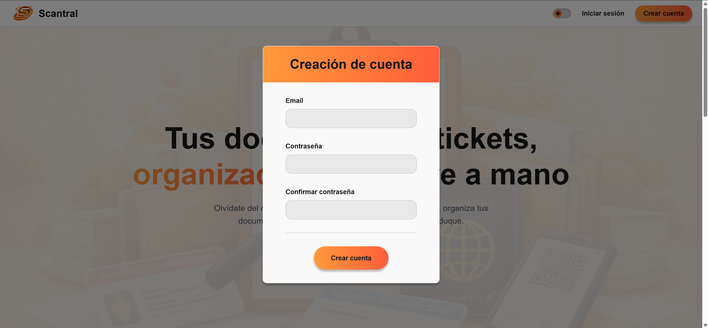
_Formulario de creación de cuenta._

### 9.2.2. Inicio de sesión

1. Accede a [https://scantral.com](https://scantral.com).
2. Introduce tu correo electrónico y contraseña.
3. El botón **Iniciar sesión** se habilita automáticamente en cuanto el email y la
   contraseña tienen un formato válido.
4. Haz clic en **Iniciar sesión**.

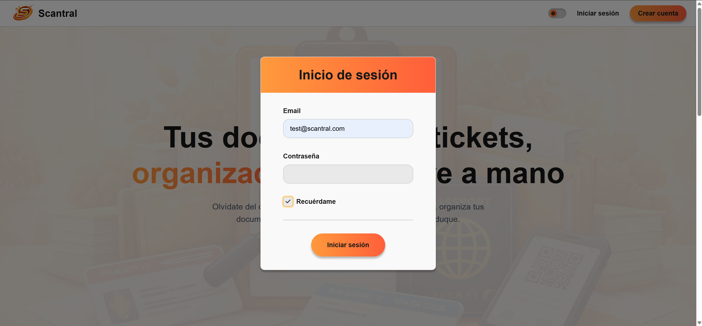
_Pantalla de inicio de sesión._

> **Nota:** La sesión se mantiene activa durante 24 horas. Pasado ese tiempo deberás volver
> a iniciar sesión.

---

## 9.3. Dashboard — gestión de documentos

### 9.3.1. Vista general

El dashboard es la pantalla principal tras iniciar sesión. Muestra todos los documentos
registrados en forma de tarjetas, con un indicador visual del estado de cada uno:

| Color / etiqueta | Significado |
|---|---|
| Verde — **Activo** | El documento está vigente |
| Naranja — **Por expirar** | La fecha de caducidad está próxima |
| Rojo — **Expirado** | El documento ha superado su fecha de caducidad |

La barra lateral izquierda da acceso al resto de secciones: **Dashboard**, **Grupos**,
**Validador**, **Ajustes** y el botón de cierre de sesión.

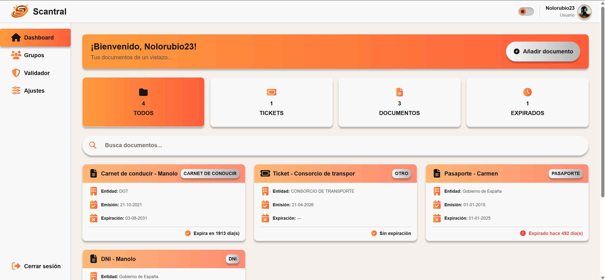
_Dashboard con tarjetas de documentos y barra lateral._

### 9.3.2. Buscar y filtrar

Encima de las tarjetas de documentos encontrarás:

- **Barra de búsqueda**: filtra por título en tiempo real.
- **Filtros rápidos** (pestañas): *Todos*, *Tickets*, *Documentos*, *Expirados*.
- **Paginación**: navega entre páginas si tienes más de 9 documentos.

### 9.3.3. Añadir un documento

El modal de subida guía al usuario a través de un asistente paso a paso con barra de
progreso:

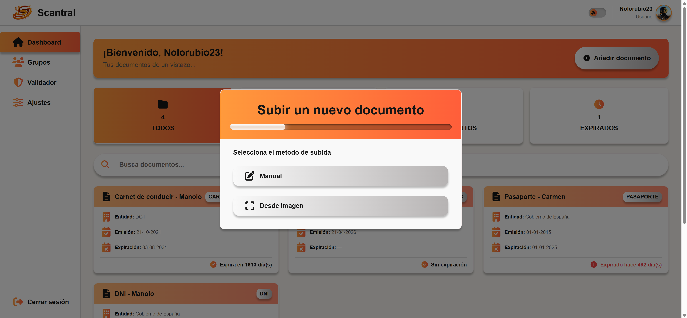
_Paso 1: elección del método de registro (manual o desde imagen)._

**Paso 1 — Método de registro**

Elige entre dos opciones:
- **Manual**: introduces los datos a mano (título, tipo, fechas, notas).
- **Desde imagen**: subes una foto o escaneo del documento y el sistema extrae los datos
  automáticamente.

**Paso 2 (si elegiste «Desde imagen») — Subida de imagen**

Selecciona el archivo desde tu dispositivo. Una vez cargado, el sistema
procesa la imagen con el siguiente pipeline de extracción:

1. **Extractor OCR (PaddleOCR)**: el sidecar PaddleOCR ejecutado localmente extrae el texto
   de la imagen y aplica reglas de reconocimiento de patrones para identificar los datos
   relevantes (tipo de documento, fechas, importe, comercio, etc.).
2. **Extractor IA (Gemini)** *(opcional)*: si el usuario ha activado la extracción por IA,
   la imagen se envía a la API de Google Gemini para un análisis semántico más
   completo. El uso de este extractor es opcional; si no está habilitado o si la llamada
   falla, el sistema utiliza automáticamente el resultado del paso anterior (OCR).

El resultado se propone en el formulario final, donde puedes revisarlo y corregirlo antes
de guardar.

**Paso 3 — Tipo de documento**

Selecciona si se trata de un **ticket/factura** o un **documento oficial**. Esto determina
qué campos aparecen en el formulario.

**Paso 4 — Categoría**

Elige la categoría específica entre las disponibles:

| Categoría | Cuándo usarla |
|---|---|
| DNI | Documento Nacional de Identidad |
| Pasaporte | Pasaporte |
| Carnet de conducir | Permiso de conducción |
| Seguro | Póliza de seguro de cualquier tipo |
| ITV | Inspección Técnica de Vehículos |
| Ticket / Recibo | Justificante de compra o pago |
| Garantía | Garantía de producto |
| Factura | Factura de servicio o producto |
| Otro | Cualquier documento que no encaje en las anteriores |

**Paso 5 — Formulario de datos**

Revisa y completa los datos extraídos (o introdúcelos manualmente si elegiste ese método):
- **Título**: nombre descriptivo del documento.
- **Comercio/Entidad** (opcional): nombre del comercio o entidad emisora.
- **Fecha de emisión** (opcional).
- **Fecha de expiración** (opcional; determina el estado y las alertas).
- **Imagen del documento** (opcional): Imagen asociada del documento.

Haz clic en **Crear documento** para añadir el documento a tu biblioteca.

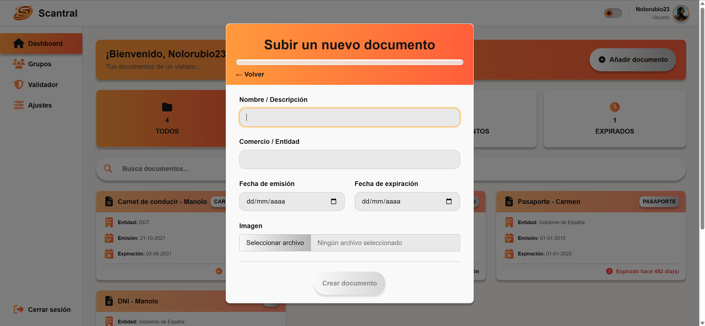
_Paso 5: revisión y edición de los datos extraídos antes de guardar._

---

## 9.4. Detalle de documento

Haz clic sobre cualquier tarjeta del dashboard para acceder al detalle del documento. La
vista se organiza en pestañas:

### 9.4.1. Detalles del documento

La pestaña **Detalles del documento** muestra:
- Vista previa de la imagen del documento (si se subió una).
- Campos del documento: título, comercio/entidad, tipo, categoria...
- Estado actual (Activo / Por expirar / Expirado) con su color indicativo.

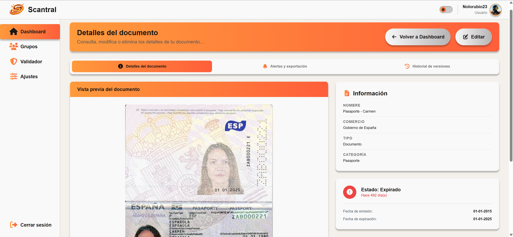
_Vista de detalle con pestañas: Información, Alertas, Exportar e Historial._

### 9.4.2. Alertas y exportación

La pestaña **Alertas y exportación** permite configurar recordatorios por correo electrónico que se
envían automáticamente antes de que el documento caduque:

1. Activa uno de los **presets rápidos**: 1 día, 7 días o 30 días antes de la caducidad.
2. O define un número de días **personalizado** en el campo de texto y haz clic en el
   botón **+ Añadir alerta**.

Cada alerta aparece listada con la opción de desactivarla. Las alertas solo están
disponibles para documentos que tengan fecha de caducidad configurada.

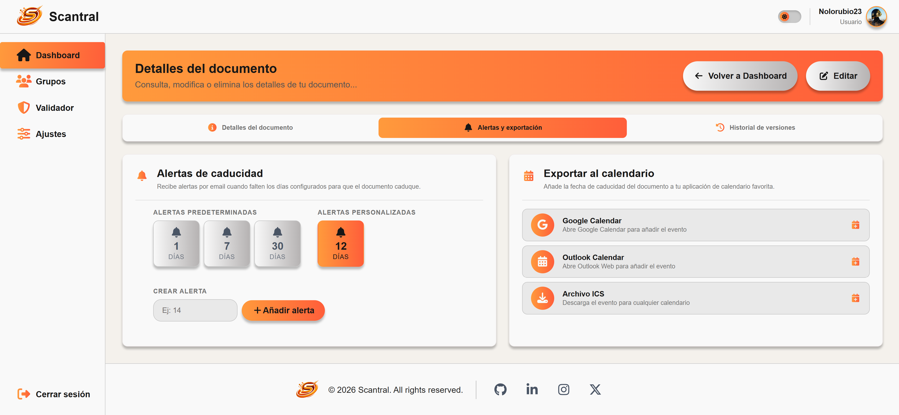
_Pestaña Alertas con presets rápidos y alerta personalizada._

> **Importante:** Para recibir los correos de alerta debes tener configurado un correo
> electrónico válido en tu cuenta (sección Ajustes).

### 9.4.3. Exportar a calendario

En la misma pestaña de **Alertas y exportación** podemos generar un evento de recordatorio con la fecha de caducidad del documento para importarlo en tu aplicación de calendario preferida:

| Opción | Acción |
|---|---|
| **Google Calendar** | Abre Google Calendar en una nueva pestaña con el evento prellenado |
| **Outlook** | Abre Outlook Web con el evento prellenado |
| **Archivo .ics** | Descarga un fichero iCal compatible con Apple Calendar, Thunderbird, etc. |

### 9.4.4. Historial de versiones

La pestaña **Historial de versiones** registra cada vez que se ha editado el documento, mostrando qué
campos cambiaron, los valores anteriores y la fecha de modificación. Útil para el
seguimiento de renovaciones de documentos oficiales.

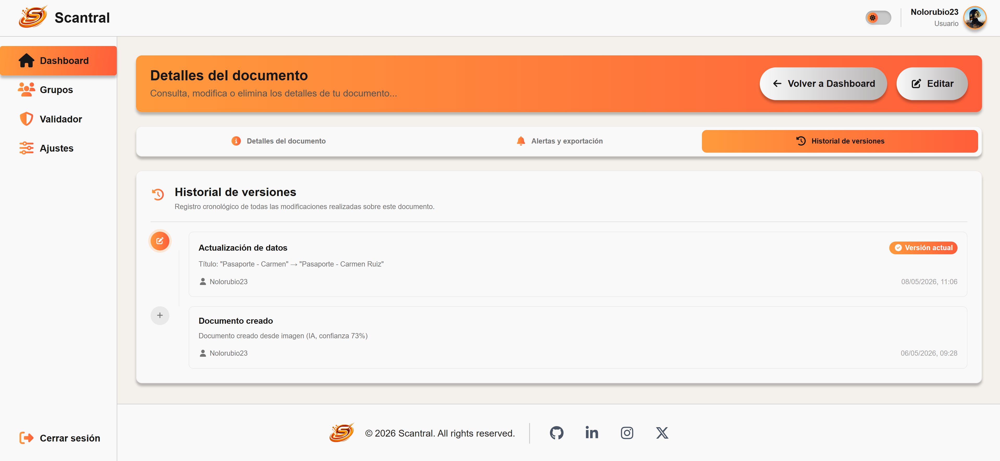
_Pestaña Historial con la lista de cambios y valores anteriores._

### 9.4.5. Editar y eliminar

- **Editar**: haz clic en el botón de edición (icono lápiz) para abrir el modal de edición
  y modificar cualquier campo del documento.
- **Eliminar**: al final de la página, la tarjeta de eliminación solicita confirmación
  antes de borrar el documento de forma permanente.

---

## 9.5. Grupos compartidos

Los grupos permiten compartir documentos con otras personas (familia, pareja, compañeros
de piso). Cada grupo tiene un **código de invitación** único que puedes compartir para
que otros usuarios se unan.

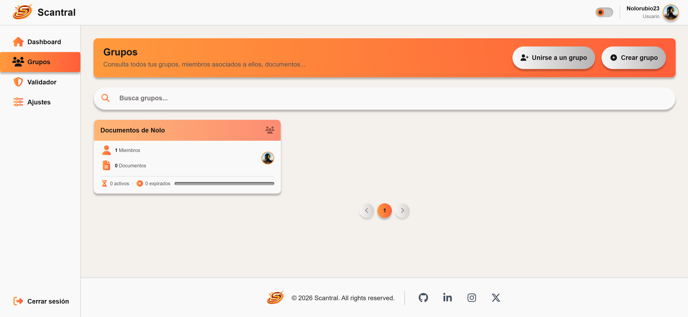
_Página de grupos con botones para crear y unirse a un grupo._

### 9.5.1. Crear un grupo

1. Accede a la sección **Grupos** desde la barra lateral.
2. Haz clic en **Crear grupo** (icono +).
3. Introduce el nombre del grupo, detalla quien puede editar documentos dentro de el y confirma.
4. Aparecerá la tarjeta del grupo con su código de invitación. Cópialo para compartirlo.

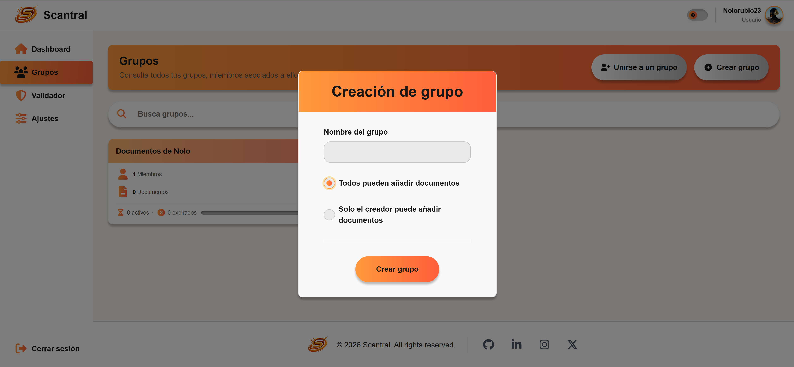
_Modal para crear un nuevo grupo con nombre y permisos de edición._

### 9.5.2. Unirse a un grupo

1. Accede a la sección **Grupos**.
2. Haz clic en **Unirse a un grupo** (icono de persona+).
3. Introduce el código de invitación que te ha facilitado el administrador del grupo.
4. Haz clic en **Unirse al grupo**. El grupo aparecerá en tu lista.

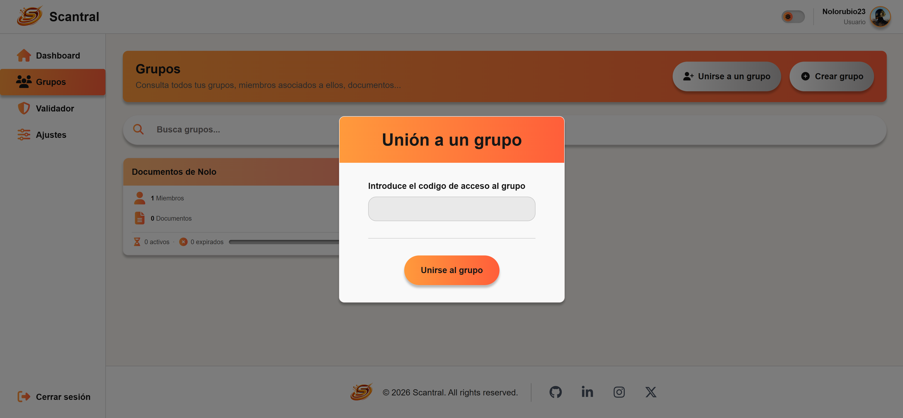
_Modal de entrada con el campo para introducir el código de invitación._

### 9.5.3. Gestionar documentos del grupo

Al acceder al detalle de un grupo verás todos los documentos compartidos por sus miembros.
Desde aquí puedes:
- Consultar cualquier documento del grupo y editarlo (según los permisos).
- Añadir un nuevo documento (según los permisos del grupo).
- Ver los miembros actuales y el código de invitación.
- **Abandonar el grupo** con el botón correspondiente (se solicita confirmación).
- El **administrador** del grupo puede eliminarlo; esto retira el acceso a todos los miembros.

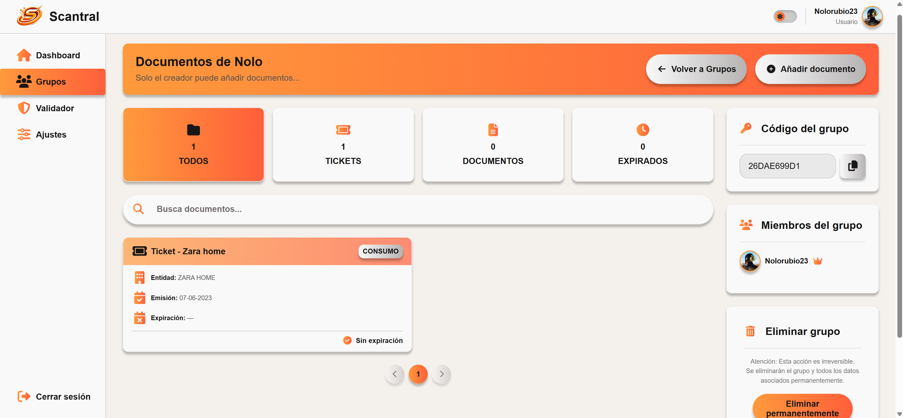
_Vista de detalle de grupo con documentos compartidos, miembros y código de invitación._

---

## 9.6. Validador de documentos

El validador responde a la pregunta: *«¿Qué documentos oficiales seguirán siendo válidos
el día X?»*. Útil antes de viajes, citas o trámites con fecha fija.

### Selección de fecha

La tarjeta del validador ofrece dos formas de elegir la fecha de comprobación:

**Presets rápidos** — botones de acceso directo para los escenarios más comunes:

| Preset | Fecha resultante |
|---|---|
| **Hoy** | El día de hoy |
| **+6 meses** | Seis meses a partir de hoy |
| **+1 año** | Un año a partir de hoy |
| **+2 años** | Dos años a partir de hoy |

**Calendario inline** — si ningún preset se ajusta a tu necesidad, selecciona cualquier
día directamente en el calendario integrado. Navega entre meses con las flechas laterales
y haz clic sobre el día deseado. La fecha seleccionada queda resaltada y se muestra
formateada debajo de la tarjeta.

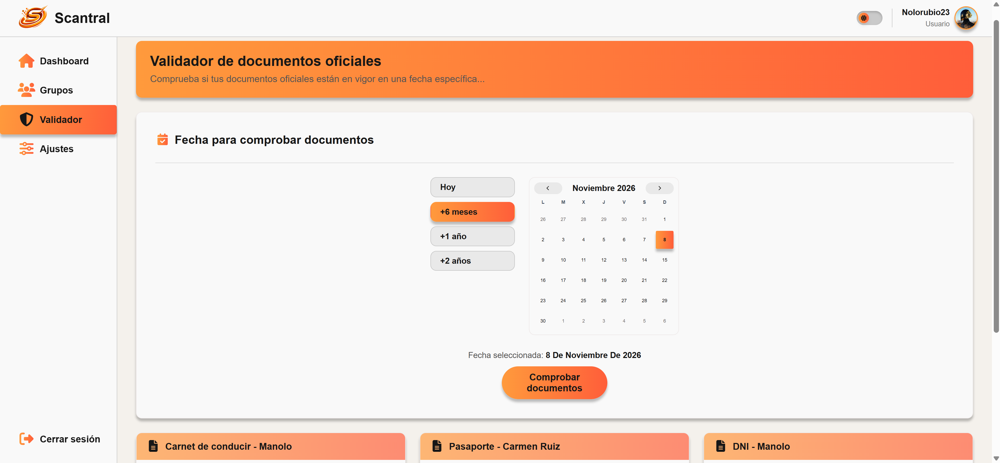
_Tarjeta del validador con presets rápidos y calendario inline._

### Comprobar la vigencia

Una vez fijada la fecha, haz clic en **Comprobar documentos**. El sistema analiza todos tus
documentos oficiales (DNI, Pasaporte, Carnet de conducir, Seguro, ITV) y muestra un
resultado por cada uno:

- ✅ **Válido** — el documento no habrá caducado en esa fecha.
- ❌ **Expirado** — el documento habrá caducado antes de esa fecha.

> **Nota:** El validador solo tiene en cuenta los documentos con fecha de caducidad
> configurada y de categoría oficial. Los tickets y garantías no aparecen en esta vista.

---

## 9.7. Ajustes de cuenta

Accede a **Ajustes** desde la barra lateral o el menú de usuario para personalizar tu
perfil:

| Opción | Descripción |
|---|---|
| **Email** | Actualiza la dirección de correo (también usada para las alertas) |
| **Nombre de usuario** | Cambia el nombre visible en la aplicación |
| **Contraseña** | Introduce la contraseña actual y la nueva para cambiarla |
| **Avatar** | Sube una foto de perfil desde tu dispositivo |
| **Eliminar cuenta** | Elimina permanentemente tu cuenta y todos tus documentos (requiere confirmación) |

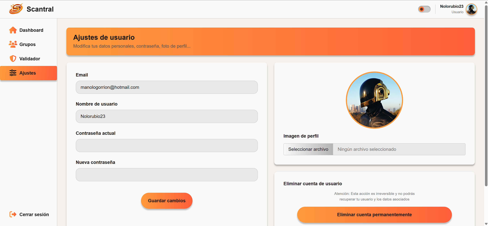
_Página de ajustes con formulario de perfil y opciones de cuenta._

---

## 9.8. Preguntas frecuentes y solución de problemas

**El OCR no ha extraído bien los datos de mi imagen. ¿Qué hago?**  
La extracción automática puede fallar con imágenes borrosas, torcidas o con baja resolución.
En ese caso:
1. Revisa los campos extraídos en el último paso del modal y corrígelos manualmente antes
   de guardar.
2. Si quieres reintentar la extracción, cierra el modal, mejora la imagen (más luz, encuadre
   recto) y vuelve a subirla.
3. Activa la extracción por IA (Gemini): en el paso de subida de imagen, marca la opción
   de usar IA para obtener un análisis semántico más preciso, especialmente útil en
   documentos con diseños complejos, texto pequeño o campos poco estructurados.
4. Si ninguna extracción automática da un resultado satisfactorio, usa el método **Manual**
   para introducir los datos directamente.

---

**Mi documento aparece como «Expirado» pero creo que sigue vigente.**  
Comprueba la fecha de caducidad registrada: accede al detalle del documento y verifica el
campo «Fecha de caducidad». Si es incorrecta, edita el documento con el botón de edición
y corrígela.

---

**No recibo los correos de alerta de caducidad.**  
Verifica lo siguiente:
1. En **Ajustes**, comprueba que tienes un correo electrónico válido configurado.
2. Revisa la carpeta de **spam o correo no deseado** de tu gestor de correo.
3. Asegúrate de que la alerta está activada en la pestaña **Alertas** del documento y de
   que el documento tiene fecha de caducidad.

---

**No consigo unirme a un grupo aunque tengo el código.**  
- Verifica que el código es exacto (distingue mayúsculas y minúsculas).
- Comprueba que no estás ya miembro de ese grupo (aparecería en tu lista de grupos).
- Pide al administrador del grupo que confirme que el grupo sigue activo.

---

**Al subir una imagen grande la extracción tarda mucho o falla.**  
El proceso de OCR puede tardar hasta 30 segundos en imágenes complejas. Si transcurrido
ese tiempo no obtienes resultado, el sistema habrá agotado el tiempo de espera. Prueba con
una imagen de menor resolución o usa el método manual.

---

**¿Mis documentos son privados?**  
Sí. Cada usuario solo puede acceder a sus propios documentos. Los documentos de grupos
compartidos son visibles únicamente para los miembros de ese grupo. Las imágenes se
almacenan en el servidor y no son accesibles públicamente.

---

**¿Cómo cambio al modo oscuro?**  
Haz clic en el interruptor de apariencia (icono sol/luna) situado en la esquina superior
de la cabecera. La preferencia se guarda automáticamente en tu navegador y se respeta en
futuras visitas.

---

**¿Puedo subir cualquier formato de imagen?**  
El sistema acepta los formatos más habituales: JPG, JPEG, PNG, WEBP y HEIC/HEIF (fotos tomadas con iPhone).
Para mejores resultados de extracción, usa imágenes con buena iluminación, enfoque nítido
y el documento centrado y sin recortes.

---

**¿Cómo exporto a calendario si no aparece la pestaña de exportación?**  
La pestaña **Alertas y exportación** solo está disponible para documentos que tengan
fecha de caducidad configurada. Edita el documento, añade una fecha de caducidad y la
pestaña aparecerá automáticamente.

---

**He eliminado un documento por error. ¿Puedo recuperarlo?**  
No. La eliminación de documentos es permanente e irreversible. Antes de confirmar el
borrado, el sistema muestra un diálogo de confirmación; asegúrate de leerlo antes de
aceptar.

---

**¿Puedo cambiar el administrador de un grupo?**  
Actualmente no existe una transferencia de administración desde la interfaz. Si necesitas
cambiar el administrador, el administrador actual debe eliminar el grupo y el nuevo
administrador puede crearlo de nuevo e invitar a los miembros.

---

**La aplicación se ve mal o no carga correctamente.**  
Prueba los pasos siguientes:
1. Fuerza la recarga de la página con **Ctrl + Mayús + R** (o **Cmd + Shift + R** en Mac).
2. Borra la caché del navegador.
3. Comprueba que tu navegador está actualizado; Scantral requiere un navegador moderno
   compatible con ES2020+ (Chrome 90+, Firefox 90+, Edge 90+, Safari 15+).
4. Si el problema persiste, contacta con el administrador del servicio.
